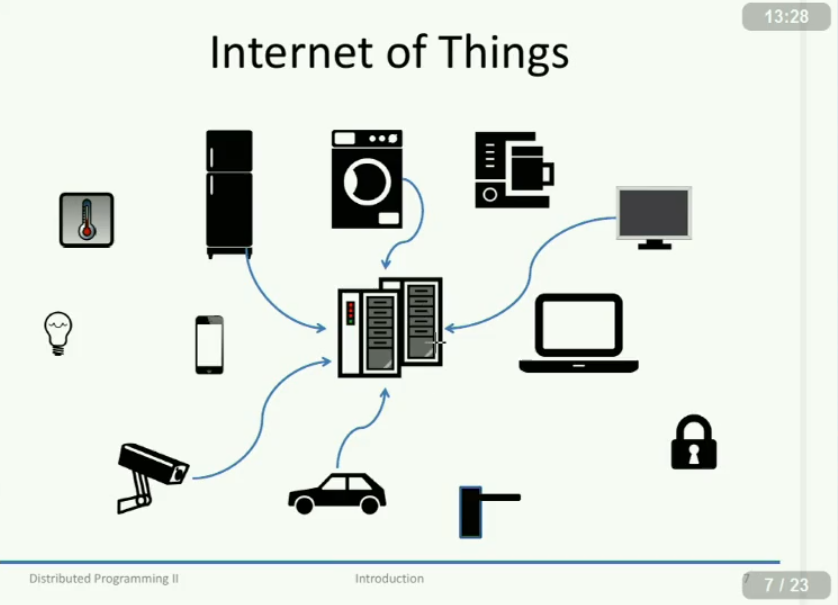
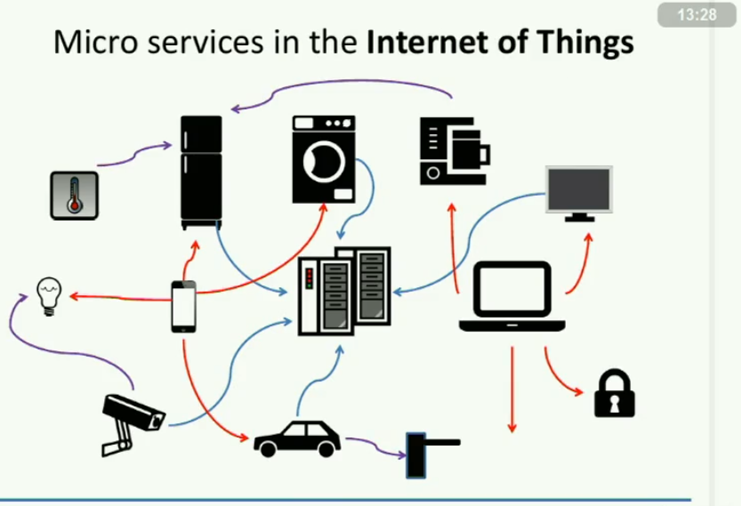
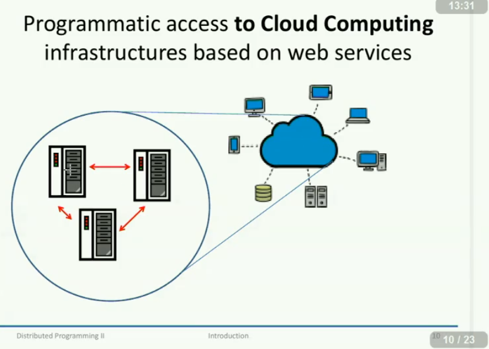
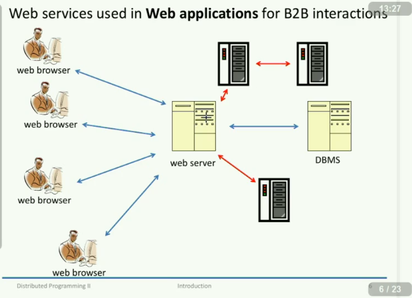

# Distributed programming II

Il corso viene tenuto dal prof. Riccardo Sisto in collaborazione con l'assistente Ing. Serena Spinoso.

## 00 - Introduzione al corso

- [ ] Programma e obiettivi del corso
- [ ] Organizzazione
- [ ] Materiale di supporto
- [ ] Regole d'esame

## Programma e obiettivi del corso

L'obiettivo principale del corso è quello di concludere la consocenza degli argomenti trattati nei corsi di *Distributed programming I* e di *Object oriented programming*.

In particolare nel primo corso ci si era posti come obiettivi:

1. `network programming` ossia programmare i socket.
2. `web application`  ossia siti web.

Questo corso sarà orientato vero la parte di _Web application_ focalizzandoci sulle interazioni B2B. I principali concetti chiave di questo corso sono:

1. conoscere le principali tecniche di sviluppo di software distribuito, cioè **applicazioni B2B** (Business to Business) ossia *machine to machine iteration*  in contraposizione (rispetto a DP1) con con l'iterazione tra utente e servizio web. In DP2 gestiremo le interazioni tra due o più servizi web.

2. per fare quanto detto nel precedente punto, impareremo l'**XML** e a sviluppare **servizi Web**.

Tutto questo tenendo conto degli aspetti della *robustezza*, *sicurezza*, *portabilità* ed *interoperabilità* delle applicazioni che impareremo a sviluppare.

**XML** è uno standard che viene utilizzato per rapresentare i dati sul web (sopratuttto per lo scambio di dati tra piattaforme diverse). Si potrebbe dire che è simile a XDR. XML serve per rappresentare qualsiasi dato e ed è "charater oriented", cioè utilizzeremo solo stringhe.

I **servizi Web** sono quei programmi (o daemons) che interagiscono tra di loro nel web, per svilupparli in questo corso utilizzeremo il linguaggio Java.

### Cosa ci sarà di nuovo rispetto al corso di DP1?

Sostanzialmente, ci concentreremo sullo sviluppo di **applciazioni Web** nelle interazioni B2B, ma parleremo anche di micro servizi nell'**Internet delle cose** (ovvero: **IoT**). Faremo anche alcune cose che riguradano l'accesso programmato ai servizi di **cloud computing***.

#### Le Web applications

> #### Web application
>
> In informatica l'espressione applicazione web, ovvero web-application in inglese, indica genericamente tutte le applicazioni distribuite web-based.
>
> Nell'ingegneria del software e nella programmazione Web essa indica infatti un'applicazione accessibile/fruibile via web per mezzo di un network, come ad esempio una Intranet all'interno di un sistema informatico o attraverso la Rete Internet, ovvero in una architettura tipica di tipo client-server, che offre determinati servizi all'utente client: un generico client accede connettendosi a funzionalità applicative residenti su un application server utilizzando come terminali utente normali web browser appoggiandosi dunque ai consueti protocolli di rete (i client finalizzati unicamente a collegarsi come terminali di web-application vengono chiamati sovente thin client).

In questo corso studieremo le Web applications? No, quelle le abbiamo già fatte in DP1. In questo corso studieremo i **Web services** che stanno alla base delle interazioni di tipo *B2B* tra le varie *Web applications*.

#### Che cos'è il paradigma B2B?

> #### B2B
>
> Business-to-business, spesso indicato con l'acronimo B2B, in italiano commercio interaziendale, è una locuzione utilizzata per descrivere le transazioni commerciali elettroniche tra imprese, distinguendole da quelle che intercorrono tra le imprese e altri gruppi, come quelle tra una ditta e i consumatori/clienti individuali (B2C, dall'inglese Business to Customer o Business to Consumer, in italiano vendita al dettaglio) oppure quelle tra una impresa e il governo (B2G, dall'inglese Business to Government, lett. "azienda-verso-governo").
>
> ##### Descrizione
>
> Si tratta di una locuzione utilizzata nel commercio elettronico o e-commerce, che di solito prende la forma di processi automatizzati tra partner commerciali, e che può anche riferirsi a tutte le transazioni effettuate in una catena di valore industriale, prima che il prodotto finito venga venduto al consumatore finale.
>
> Più specificamente, Business-to-Business o B2B indica le relazioni che un'impresa detiene con i propri fornitori per attività di approvvigionamento, di pianificazione e monitoraggio della produzione, o di sussidio nelle attività di sviluppo del prodotto, oppure le relazioni che l'impresa detiene con clienti professionali, cioè altre imprese, collocate in punti diversi della filiera produttiva.
>
> Il volume di transazioni di B2B è molto più elevato di quello di transazioni di B2C. Una delle ragioni consiste nel fatto che le imprese hanno adottato tecnologie di commercio elettronico molto di più di quanto abbiano fatto i consumatori. Inoltre, in una tipica catena di rifornimento (o catena logistica, in ing. supply chain), esistono molte transazioni di B2B, ma soltanto una transazione B2C, dato che il prodotto completo viene venduto al dettaglio al cliente finale.
>
> Per fare un esempio, il rapporto commerciale tra un produttore e un grossista è una relazione B2B. Il rapporto diretto tra produttore o grossista, da un lato, e cliente/consumatore/utente privato finale, viene invece definito B2C. Un altro esempio di transazione B2B è rappresentato da una compagnia di mangime per polli che vende il proprio prodotto a un allevamento di polli, che costituisce un'altra compagnia. Un altro esempio di transazione B2C è un negozio di alimentari che vende polli nutriti con cereali a un consumatore. B2B può anche descrivere attività di marketing tra aziende, non solo le transazioni finali che risultano dal marketing, anche se il termine può di fatto essere utilizzato per identificare transazioni commerciali tra compagnie (a cui ci si riferisce anche con il termine «vendite istituzionali»). Per esempio, è più probabile che una ditta che vende fotocopiatrici venga identificata con un'organizzazione commerciale di tipo B2B piuttosto che di tipo B2C.

#### Cos'è l'IoT?

> #### IoT
>
> In telecomunicazioni Internet delle cose (o, più propriamente, Internet degli oggetti o IoT, acronimo dell'inglese Internet of things) è un neologismo riferito all'estensione di Internet al mondo degli oggetti e dei luoghi concreti. Introdotto da Kevin Ashton, cofondatore e direttore esecutivo di Auto-ID Center (consorzio di ricerca con sede al MIT), durante una presentazione presso Procter & Gamble nel 1999[3]. Il concetto fu in seguito sviluppato dall'agenzia di ricerca Gartner.
>
> ##### Descrizione
>
> L'Internet delle cose è una possibile evoluzione dell'uso della Rete: gli oggetti (le "cose") si rendono riconoscibili e acquisiscono intelligenza grazie al fatto di poter comunicare dati su se stessi e accedere ad informazioni aggregate da parte di altri. Le sveglie suonano prima in caso di traffico, le scarpe da ginnastica trasmettono tempi, velocità e distanza per gareggiare in tempo reale con persone dall'altra parte del globo, i vasetti delle medicine avvisano i familiari se si dimentica di prendere il farmaco. Tutti gli oggetti possono acquisire un ruolo attivo grazie al collegamento alla Rete.
>
> L'obiettivo dell'internet delle cose è far sì che il mondo elettronico tracci una mappa di quello reale, dando un'identità elettronica alle cose e ai luoghi dell'ambiente fisico. Gli oggetti e i luoghi muniti di etichette Identificazione a radio frequenza (Rfid) o Codici QR comunicano informazioni in rete o a dispositivi mobili come i telefoni cellulari.
>
> I campi di applicabilità sono molteplici: dalle applicazioni industriali (processi produttivi), alla logistica e all'infomobilità, fino all'efficienza energetica, all'assistenza remota e alla tutela ambientale.
>
> L'internet delle cose tende ad evolversi in modo parallelo e reciproco al web semantico.

In questo corso studieremo l'**IoT**? No. Studieremo in modo ragionevolmente approfondito come avvengono alcuen itnerazioni tra i dispositivi coinvolti nell'**IoT** e dal un punto di vista distribuito e non centralizzato.

Ci sono due modo di pensare le connessioni tra i vari elementi dell'IoT. Il primo è quello di connettere i dispositivi tra di loro utilizzando un solo "Web service" centrale o meglio dire un server che fornisca a loro i vari servizi.

Il secondo modo è quello in cui tali elementi comunichino tra di loro in maniera distribuita, con o senza la presenza di un server principale. Questo tende a dare un carattere più indipendente a ciascun dispositivo.

Un altra tecnologia per IoT è **IPv6**. Quindi ai giorni nostri molte applicazioni hanno la compatibilità con questo protocollo anche se non è ancora pienamente sfruttato, le aziende all'avanguardia spingono molto per _"abbandonare"_ IPv4 in favore di IPv6.

#### Che cos'è il cloud computing?

> #### Cloud computing
>
> In informatica con il termine inglese cloud computing (in italiano nuvola informatica) si indica un paradigma di erogazione di risorse informatiche, come l'archiviazione, l'elaborazione o la trasmissione di dati, caratterizzato dalla disponibilità on demand attraverso Internet a partire da un insieme di risorse preesistenti e configurabili.
>
> Le risorse non vengono pienamente configurate e messe in opera dal fornitore apposta per l'utente, ma gli sono assegnate, rapidamente e convenientemente, grazie a procedure automatizzate, a partire da un insieme di risorse condivise con altri utenti lasciando all'utente parte dell'onere della configurazione. Quando l'utente rilascia la risorsa, essa viene similmente riconfigurata nello stato iniziale e rimessa a disposizione nel pool condiviso delle risorse, con altrettanta velocità ed economia per il fornitore.

In questo corso studieremo il **cloud computing**? No. Studieremo i meccanismi interni ai sistemi basati sul cloud, ovvero apriremo la nuvola e guarderemo com'è fatta dentro.

Quando si parla di **cloud computing** non si deve pensare ai sistemi di calcolo distribuito, per esempio servizi che forniscono potenza di calcolo, infatti, la maggior parte dei servizi di _cloud computing_ sono basati sulla **condivisione** dei dati, buona parte sull'offerta di servizi (si pensi a _GitHub_, _Trello_, _Zapier_ e via dicendo). Quindi nella _"nuvola"_ si può trovare (per così dire) _di tutto_, il fattore caratterizzante del cloud computing è che è accessibile attraverso _Internet_. 

Nella nuvola si hanno dei server che devono parlare tra di loro per svolgere dei servizi.

 

Più specificatamente, le tecniche che studieremmo in questo corso sono alla base per tutti questi ambienti. 

Nel primo corso avevamo studiato la parte che c'è tra l'utente e la macchina (web-server) tra lasciando ciò che accadeva **dietro le quinte** (ovvero B2B).

Qui andremmo a vedere l'iterazione tra i vari server che stanno dietro alle quinte come si può vedere con le frecce rosse nel disegno sotto.  In questo modo, ogni server da un contributo diverso ed in più. 

## Prerequisiti del corso

Quattro grandi argomenti sono necessari per affrontare con serenità questo corso:

- [ ] come funziona un **sistema operativo** e le basi per interagire con esso
- [ ] le reti telematiche, in particolare è richiesta la conoscenza dei protocolli **TCP/IP** e **HTTP** (sapere molto bene http). Si userà molto il paradigma *restful*, ovvero: GET, UPDATE, DELETE, … .
- [ ] ciò che abbiamo imparato in **DP1**.
- [ ] infine bisognerà saper usare ragionavolmente bene il linguaggio **Java**.

## Argomenti del corso

I principali argomenti inclusi in questo corso sono:

1. il linguaggio **XML** e i relativi strumenti Java per utilizzarlo o meglio dire frameworks:

   1. `JAXP`
   2. `JAXB`
2. conosceremo l'architettura delle applicazioni distribuite nel senso di applicazioni sviluppate secondo i seguenti paradigmi:

   1. object-oriented
   2. component-oriented
   3. service-oriented (soprattutto)
3. i *Web services* (quelli visti poco fa, **non** le Web applications) e il relativo strumenti per svilupparli, ovvero `JAX-RS`
4. altre cose, come *ant* per il supporto automatizzato dello sviluppo, le *annotazioni Java* e così via...

Negli anni passati si vedeva anche sop web-services e rest-full, quest'anno ci concentriamo di più su rest-full perché il trend generale lo usa maggiormente.

## Esercizi e laboratori

In classe verrano svolti alcuni esercizi d'esempio mostrando le varie tecniche e possibili soluzioni.

Ai laboratori (sempre ai **LABINF**) verranno presentati quelli che si chiamano *assignments*. Sono **importanti**, poiché obbligatori per fare l'esame. Ciasun laboratorio dura un'ora e mezza a settimana, sono strettamente individuali e nei LABINF gli assistenti forniranno un importante aiuto.

Lo svolgimento dei laboratori si tiene sempre di lunedì ma è diviso in due squadre:

- **GROUP 1**: studenti dalla *A* alla *K* e dalle 13:00 alle 14:30,
- **GROUP 2**: studenti dalla *L* alla *Z* e dalle 14:30 alle 16:00.

I laboratori inizieranno già il **10 ottobre 2016**.

Una parte dei laboratori sarà tenuta dall'ing. Spinoso, l'altra parte dal prof. Sisto. 

## Materiale di supporto

Tutto il materiale utile può essere trovato nella [pagina del corso](https://pad.polito.it:8080/enginframe/dp2/dp2.xml?_uri=//dp2/material). Il corso è anche videoregistrato (sulla nostra pagina personale).

Per accedere alla pagina del corso si deve usare il seguente link se si è connessi direttamente alla rete del campus:
https://pad.polito.it:8080

Fuori dal campus:
https://pad.polito.it

## Regole d'esame e assignments

L'esame consiste in tre punti:

1. valutazione degli **assignments**
2. prova scritta ai LABINF (possibile esonero se gli assignments sono stati svolti brillantemente)
3. facoltativo un orale finale che potrebbe essere chiesto dallo studento (se il voto non è quello che vorebbe avere) o dal professore se ci sono dei dubbi.

##### Gli assignments

Ciascun assignment verrà proposto ad ogni laboratorio e dovranno essere consegnati entro una data prestabilita che è relativa all'appello d'esame in cui si vuole passare, se qualche assignments verrà consegnato oltre tale data, l'assignment non verrà considerato nella valutazione.

Inoltre, ogni assignment deve essere svolto individualmente. Se il docente scopre che qualcuno ha copiato o hanno lavorato insieme, verranno **entrambi** segnalati alla commissione disciplinare. Bisogna quindi stare molto attenti anche a far si che la propria soluzione rimanga al sicuro e che nessuno ce la copi.

La data di consegna di solito sono due giorni lavorativi prima dell'esame in cui si vuole sostenere.

Si consegnano gli assegnaments come quando di faceva DP1 con il sito.

Quando si consegnato i laboratori ci sono dei test che vengono fatti in automatico dal sistema e il laboratorio deve passare i mandatory test. Se non gli passa allora si deve ri-caricare il laboratorio con le opportune modifiche. Ci sarà anche la possibilità di provare i nostri laboratori in locale, tuttavia è buona norma mandare i laboratori non all'ultima ora ma ben prima in modo da verificare e corregere eventuali errori se non passa i tests.

##### Ammissione al test finale

Si può essere ammessi solo se ogni assignment superi almeno i test di base. Si noti che si possono consegnare gli assignment (anche tutti assieme) solo entro due giorni **lavorativi** prima dell'inizio della prova scritta ai LABINF. Quindi, se l'esame è di lunedì, bisogna consegnare gli assignment entro mercoledì! Poiché sabato e domenica non sono due giorni lavorativi.

Possiamo anche essere esonerati se i laboratori sono molto buoni e molto diverrsi l'uno dall'altro.

Inoltre per sapere se non dobbiamo andare all'esame finale lo sapremmo solo 1 giorno prima rispetto all'esame stesso. Perché per valutarli deve aspettare che tutti abbiano consegnato e visto che la scadenza è per l'appunto due giorni lavoratori va da se che lo sapremmo solo dopo. Quindi è meglio prepararsi e poi la più non si va perché si ha avuto una buona sorpresa.

Un altro modo per non sostenere  l'esame è di fare una tesi o una "tesina" (progetto speciale) tutto relativo al corso. I numeri di progetti sono limitati quindi ci sarà una selezione se ci sono tanti studenti che richiedono una.

In alcuni casi si può fare un progetto (tesi o tesina) assieme ma solo perché mettendo a ssieme il tutto si ottiene una gorssa cosa quindi è come se ci fossero molte tesi o tesine.

##### Il professore controllerà i tuoi assignments!

Fare molta attenzione ai propri elaborati, perchè il docente, con il supporto di software adeguato, farà dei contorlli incorciati per verificare che due assignments non siano troppo uguali e quindi sospetti.

##### La prova scritta ai LABINF

La prova finale è facoltativa. Dipende da come sono stati fatti gli assignments. Se sono di buona qualità non ci sarà bisogno di fare la prova finale e molto diversi dai nostri compagni. Tale prova consiste nello svolgimento di un nuovo assignment più una domanda aperta (relativa ai nostri laboratori su come abbiamo svolto gli  assignmen), il tutto da svolgersi nell'arco di due ore oppure due ore e mezza. Questa prova verrà considerata superata se l'elaborato scritto supererà i test obbligatori. Faremo una simulazione di questa prova verso la fine del corso: è **importante** esserci!

Per passare la prova scritta si deve passare i test obbligatori se no non si passa la prova. In alcuni casi se non si passa l'esame ma l'errore è cosi piccolo allora il professore potrebbe fare passare l'esame.

##### Valutazione finale

I punti assegnati verranno calcolati nel seguente modo:

- gli assignment verranno valutati con un punteggio minimo di 16 (solo se si passa  i test obbligatori) e un massimo di 20 punti (se si passa anche i test non obbligatori quindi extra-test),
- la prova scritta ha un range da 0 a 6 punti,
- la domanda aperta vale da 0 a 4 punti.

Il professore ci darà un voto finale se ci piace bene se no in casi speciali si può richiedere un orale.

Durante l'orale può chiedere delle cose e andranno ad influire sulla notazione finale sia in positivo sia in negativo.

Per avere la lode è necessario fare l'orale.

## Contattare i docenti

- prof Riccardo Sisto
  - [email](riccardo.sisto@polito.it)
  - telefono ufficio: 011 090 7073
  - riceve su appuntamento
- Ing. Serena Spinoso
  - [email](serena.spinoso@polito.it)
  - telefono ufficio: 011 090 7098
  - riceve su appuntamento