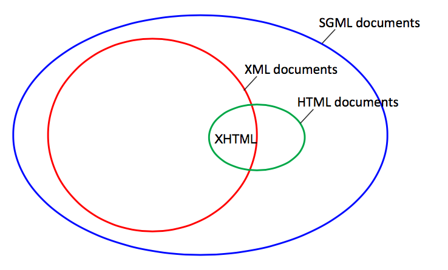
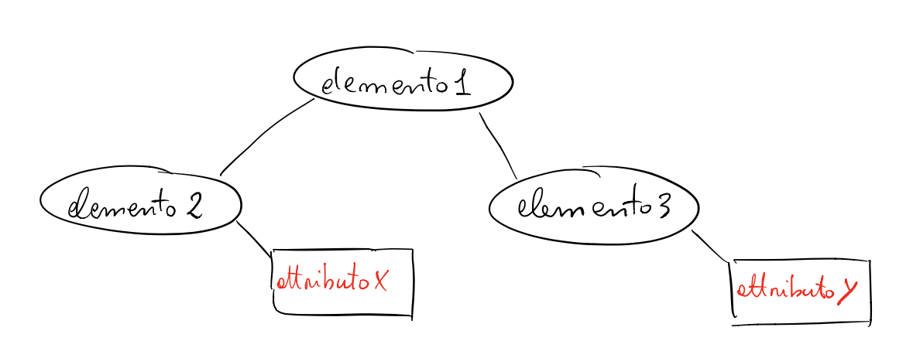
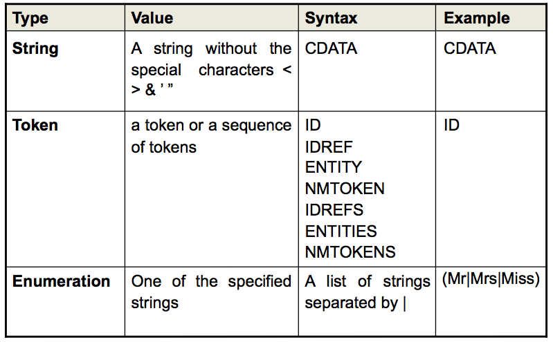
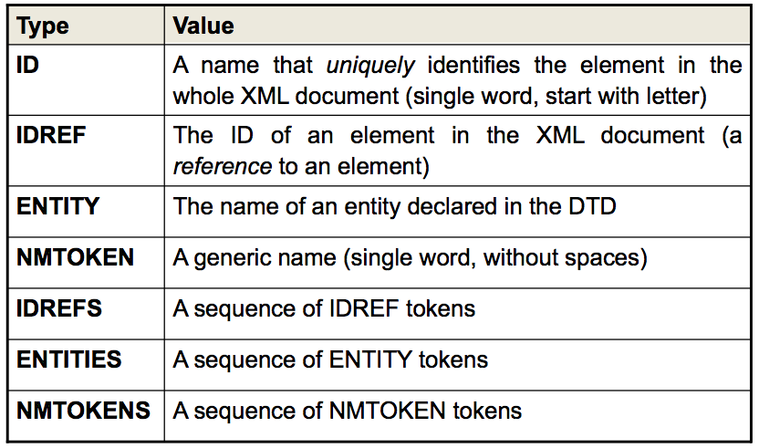

# 02 - XML

XML (sigla di eXtensible Markup Language) è un metalinguaggio per la definizione di linguaggi di markup, ovvero un linguaggio marcatore basato su un meccanismo sintattico che consente di definire e controllare il significato degli elementi contenuti in un documento o in un testo.

Costituisce il tentativo di produrre una versione semplificata di Standard Generalized Markup Language (SGML) che consente di definire nuovi linguaggi di markup.

Il nome indica che si tratta di un linguaggio marcatore (markup language) estensibile (eXtensible) in quanto permette di creare tag personalizzati.


## Gli standard per lo scambio di dati in ambienti distribuiti

Ci sono degli standard che definiscono dei linguaggi che possono essere utilizzati per lo scambio di dati. Si tratta perlopiù di linguaggi che definiscono files o strutture dati in formati aperti (open formats), cioè sono *neutrali* e indipendenti dai sistemi.

Le due principali caratteristiche di ciascuno di questi standard sono:

1. essere un linguaggio in grado di definire **tipi di dati astratti**,
2. **rappresentare i dati in modo neutrale** cioè, come detto, indipendenti dai sistemi con i quali stanno interagendo.

Lo scambio di dati può avvenire, per esempio, tra un server basato su Java Spring e un client basato su JavaScript e i dati sono codificati tramite **JSON**. Tra le due piattaforme ci sarà un minimo di elaborazione per la *codifica/decodifica* di tali dati.

Di questi standard citiamo:

- **ASN-1** - Abstract Syntax Notation One e indica un linguaggio astratto che può essere usato per descrivere una notazione, le relative procedure di encoding e il software che viene utilizzato per maneggiare il codice. È stato definito nel 1990 nello standard ISO 8824 e ripreso nel 2000.

- **XDR** - Sviluppato nella metà del 1980 da Sun Microsystems e pubblicato per la prima volta nel 1987. È diventato uno standard IEFT nel 1995.

- **COBRA CDR** - Common Data Representation (CDR) viene utilizzato per rappresentare dati strutturati o primitivi che vengono passati come argomenti o come valori di ritorno durante le invocazioni remote negli oggetti distribuiti CORBA (Common Object Request Broker Architecture).

  Permette la comunicazione tra client e server che sonos tati scritti in linguaggi differenti tra loro. Per esempio, può tradurre in little-endian in big-endian e viceversa. 

- **XML** -  È un metalinguaggio per la definizione di linguaggi di markup, ovvero un linguaggio marcatore basato su un meccanismo sintattico che consente di definire e controllare il significato degli elementi contenuti in un documento o in un testo.

- **JSON** -  Acronimo di JavaScript Object Notation, è un formato adatto all'interscambio di dati fra applicazioni client-server.

  È basato sul linguaggio JavaScript Standard ECMA-262 3ª edizione dicembre 1999, ma ne è indipendente. Viene usato in AJAX come alternativa a XML/XSLT.

In particolare **XML** e **JSON** sono quelli che attualmente stanno avendo larga diffusione e grande popolarità.


## XML (eXtensible Markup Language)

In informatica XML (sigla di eXtensible Markup Language) è un metalinguaggio per la definizione di linguaggi di markup, ovvero un linguaggio marcatore basato su un meccanismo sintattico che consente di definire e controllare il significato degli elementi contenuti in un documento o in un testo.

Costituisce il tentativo di produrre una versione semplificata di Standard Generalized Markup Language (SGML) che consente di definire nuovi linguaggi di markup, dal quale – appunto – deriva.

Il nome indica che si tratta di un linguaggio marcatore (markup language) estensibile (eXtensible) in quanto permette di creare tag personalizzati.


### Storia

Il World Wide Web Consortium (W3C), in seguito alla guerra dei browser (ovvero la situazione verificatasi negli anni novanta nella quale Microsoft e Netscape introducevano, con ogni nuova versione del proprio browser, un'estensione proprietaria all'' HTML ufficiale), fu costretto a seguire le individuali estensioni al linguaggio HTML.

Il W3C dovette scegliere quali caratteristiche standardizzare e quali lasciare fuori dalle specifiche ufficiali dell'HTML. Fu in questo contesto che iniziò a delinearsi la necessità di un linguaggio di markup che desse maggiore libertà nella definizione dei tag, pur rimanendo in uno standard.

Il "progetto XML", che ebbe inizio alla fine degli anni novanta nell'ambito della SGML Activity del W3C, suscitò un così forte interesse che la W3C creò un gruppo di lavoro, chiamato XML Working Group, composto da esperti mondiali delle tecnologie SGML, ed una commissione, XML Editorial Review Board, deputata alla redazione delle specifiche del progetto.

Nel febbraio del 1998 le specifiche divennero una raccomandazione ufficiale con il nome di Extensible Mark-up Language, versione 1.0. Ben presto ci si accorse che XML non era limitato al solo contesto web ma era qualcosa di più: uno strumento che permetteva di essere utilizzato nei più diversi contesti, dalla definizione della struttura di documenti, allo scambio delle informazioni tra sistemi diversi, dalla rappresentazione di immagini alla definizione di formati di dati.


### Usi

Rispetto all'HTML, l'XML ha uno scopo ben diverso: mentre il primo definisce una grammatica per la descrizione e la formattazione di pagine web (layout) e, in generale, di ipertesti, il secondo è un metalinguaggio utilizzato per creare nuovi linguaggi, atti a descrivere documenti strutturati. Mentre l'HTML ha un insieme ben definito e ristretto di tag, con l'XML è invece possibile definirne di propri a seconda delle esigenze.

L'XML è oggi molto utilizzato anche come mezzo per l'esportazione di dati tra diversi DBMS.


### Sintassi di base

Ecco un esempio tipico di file XML, visualizzabile all'interno di un browser qualsiasi semplicemente salvando il testo in un file con estensione .xml.

```xml
<?xml version="1.0" encoding="UTF-8"?>
<utenti>
    <utente>
        <nome>Luca</nome>
        <cognome>Cicci</cognome>
        <indirizzo>Milano</indirizzo>
    </utente>
    <utente>
        <nome>Max</nome>
        <cognome>Rossi</cognome>
        <indirizzo>Roma</indirizzo>
    </utente>
</utenti>
```


## Principali caratteristiche di XML

Le principali caratteristiche del linguaggio XML possono essere riassunte nei tre seguenti punti:

1. la rappresentazione dei dati è sia *leggibile da un essere umano* sia *leggibile dalla macchina*, il che però, non lo rende ottimale per l'occupazione di memoria e larghezza di banda.
2. I dati assumono la forma di *documenti formali*, che ricordano molto i documenti HTML.
3. I dati includono la definizione dei tipi di se stessi, il che è utile, poichè il ricevente non ha bisogno di sapere in anticipo che tipo di dati sta per ricevere.


## SGML

Lo Standard Generalized Markup Language (SGML), è un metalinguaggio definito come standard ISO (ISO 8879:1986 SGML) avente lo scopo di definire linguaggi da utilizzare per la stesura di testi destinati ad essere trasmessi ed archiviati con strumenti informatici, ossia per la stesura di documenti in forma leggibile da computer (machine readable form).

### Descrizione

Principale funzione di SGML è la stesura di testi chiamati **Document Type Definition (DTD)**, ciascuno dei quali definisce in modo rigoroso la struttura logica che devono avere i documenti di un determinato tipo. Si dice che questi documenti rispetto a SGML costituiscono un *linguaggio obiettivo*, ovvero una applicazione.

SGML è dovuto soprattutto all'opera di Charles Goldfarb e discende dal Generalized Markup Language, linguaggio definito negli anni 1960 presso la IBM, da Goldfarb, Mosher e Lorie.

L'idea centrale di SGML è quella di definire linguaggi di marcatura generica chiamata "**marcatura descrittiva**"; ogni linguaggio obiettivo definisce le caratteristiche strutturali dei documenti che governa.

L'organizzazione di un documento in un linguaggio obiettivo non è primariamente focalizzata sulla sua *resa visiva* (che potrebbe differenziarsi molto con l'uso di diversi dispositivi di visualizzazione: stampante, video, sistema Braille, ecc.), ma piuttosto sui **ruoli logico-semantici** che rivestono le parti nelle quali il documento si articola. Come esempi di questi ruoli vanno segnalati: periodi, paragrafi, capitoli (note, citazioni, tabelle), indici delle parti, indici dei nomi, indici degli autori e delle fonti - aggiunte, allegati, ecc.

Per facilitare la composizione dei documenti retti da SGML sono stati sviluppati programmi come Alml.

### Utilizzo originale

SGML fu inizialmente sviluppato per permettere lo scambio di documenti machine-readable (leggibili da un computer) in progetti governativi, legali e industriali, che devono rimanere leggibili per diverse decadi (un periodo di tempo molto lungo nell'ambito dell'informatica).

Inizialmente usato per pubblicazione di testo e basi di dati, una delle sue maggiori applicazioni fu la seconda edizione dell'Oxford English Dictionary (OED), che era ed è interamente formattato usando un linguaggio SGML.


### Terminologia SGML

- _**Documento SGML**_: è un oggetto di dati che può essere descritto utilizzando un linguaggio di markup generico, prendendo le regole di un generico documento di testo (paragrafi, dati testuali e riferimenti a DTD).
- _**Applicazione SGML**_: è un linguaggio marcatore (*markup*) che segue le specifiche SGML.


## DTD: document type definition

Il Document Type Definition (definizione del tipo di documento) è uno strumento utilizzato dai programmatori il cui scopo è quello di definire le componenti ammesse nella costruzione di un documento XML.

Il termine non è utilizzato soltanto per i documenti XML ma anche per tutti i documenti derivati dall'SGML (di cui peraltro XML vuole essere una semplificazione che ne mantiene la potenza riducendone la complessità) tra cui celeberrimo è l'HTML.

In SGML un DTD è necessario per la validazione del documento. Anche in XML un documento è valido se presenta un DTD ed è possibile validarlo usando il DTD.

Tuttavia XML permette anche documenti ben formati, ovvero documenti che, pur essendo privi diDTD, presentano una struttura sufficientemente regolare e comprensibile da poter essere controllata.

Il DTD si può dichiarare all'interno di uno stesso documento XML (dichiarazione inline).


### Esempio di riferimento allo schema DTD (documento HTML)

```html
<!DOCTYPE HTML PUBLIC "-//W3C//DTD HTML 4.01 Transitional//EN" "http://www.w3.org/TR/html4/loose.dtd">
<html>
  <head>
    <title>LOGIN</title>
    <meta http-equiv=content-type content="text/html;
                                           charset=iso-8859-1">
    <meta content="mshtml 6.00.2800.1170" name=generator>
    <link <link
    <link
          href="/images/_site/swas.css" type=text/css rel=stylesheet > href="/images/_site/Show_TableDef.css" type=text/css rel=stylesheet >
    href="/_library/styles.css" rel="stylesheet" title="styles" type="text/css">
  </head>
  <body marginheight=1 align=top border=0 topmargin=1 >
    ...
  </body>
</html>
```


### Relazioni tra SGML, HTML e documenti XML

La seguente figura mostra i gradi di relazione che sussistono tra gli standard che sono stati descritti:




## Un semplice documento XML

```XML
<?xml version="1.0"?>
<bibliography>
  <article>
    <author> J. W. Cooley </author>
    <author> J. A. Tukey </author>
    <title> An Algorithm for Machine Computation of Complex FFT </title>
    <journal volume="19" number="April 1965"> Math. Computation </journal>
  </article>
  <article>
    <author> T. G. Stockham </author>
    <title> High speed convolution and correlation </title>
    <proc year="1966"> Spring Joint Computer Conference </proc>
  </article>
  <book>
    <author> D. A. Chappel </author> <author> T. Jewell </author>
    <title> Java Web Services </title>
    <publisher> Hops Libri </publisher>
  </book>
</bibliography>
```


## Schema concettuale di un documento XML

Un **documento XML** include due aspetti:

- il _contenuto_ del documento,
- lo _stile di presentazione_ del documento.

Per _contenuto_ si intende inoltre la **sintassi **(organizzazione e formato dei contenuti) e la **semantica** (significato del contenuto).

Con i documenti **CSS** posso tenere separati il _contenuto_ dallo _stile_. In un documento XML il _contenuto_ può essere descritto in modo esplicito.


### Organizzazione logica di un documento XML

La struttura di un documento XML è piuttosto semplice: ogni *nodo* o *sotto albero* si chiama **elemento**, il quale può avere degli **attributi**. Tutti gli elementi devono contenere dei **dati**. Per esempio:

```xml
<!DOCTYPE simple SYSTEM “simple.dtd”>
<elemento1>
  <!-- Questo è un commento -->
  <elemento2 attributoX="45">
    Dato A
  </elemento2>
  <elemento3 attributoY="May 1988">
    Dato B
  </elemento3>
</elemento1>
```

Un documento XML può contenere anche altre componenti, quali:

- **dichiarazioni**, ad esempio: `<!DOCTYPE simple SYSTEM “simple.dtd”>` 
- **istruzioni di processing**
- **commenti**, ad esempio. `<!-- Questo è un commento -->`

La corrispondente rappresentazione concettuale di tale documento è:




### Organizzazione fisica di un documento XML

I documenti XML vengono distribuiti sotto forma di files chiamati **entità** (**entities**). Un'entità può fare riferimento (includere) altre entità, quindi si parla di *modularizzazione XML*. In questi casi, si individua una **entità radice** (**root entity**) la quale include le sotto entità a cui fa riferimento.

Per semplicità in questo corso considereremo solo entità semplici e indipendenti.


### Sintassi generale di un documento XML

La sintassi di un documento XML segue la sintassi generale SGML. Un documento XML è ben formato se esso segue le regole generali SGML e obbedisce ad alcune regole aggiuntive. Le regole principali sono:

- ciascuno elemento _non vuoto_ deve essere delimitato da un **tag iniziale** e un **tag finale**.
- c'è **un solo** elemento radice che contiene tuttli gli altri
- i valori degli attributi sono sempre racchiusi tra **apici**
- i nomi degli attributi devono essere unici all'interno di ogni elemento (si noti che XML è case-sensitive)


### Strutture sintattiche XML

Il principio di ogni documento XML è che i **dati** sono una sequenza di caratteri e sono caratterizzati da dei **markups**, i quali possono essere:

- i **tag delimitatori** (ad es.: `<elem>...</elem>`)
- il riferimento ad una entità
- un commento
- una dichiarazione DTD
- una dichiarazione XML
- una istruzione di processing


### Markups specifici di XML

#### Le dichiarazioni XML

Tutti i documenti xml iniziano con un prologo che contiene la dichiarazione xml, la Document Type Declaration che contiene la definizione del Document Model (se si vuole ottenere un documento valido oltre che ben formato) ed un set di dichiarazioni, a questi segue l’elemento radice del documento.

La dichiarazione xml rispetta la seguente sintassi:

```xml
<?xml version="..." encoding="..." standalone="..." ?>

...
```

e comunica al processore xml:

- la versione di XML utilizzata mediante l’attributo version
- la codifica di caratteri utilizzata mediante l’attributo encoding
- se ci sono altri file da caricare (entità esterne o DTD) mediante l’attributo standalone


#### Le dichiarazioni DTD

La document type declaration permette di indicare DTD esterne, eventuali definizioni di entità e l’elemento radice del documento XML: la Document Type Definition in particolare viene utilizzata durante la fase di validazione mediante un confronto fra il documento xml ed il modello di riferimento descritto dalla DTD.

La document type declaration rispetta la seguente sintassi:

```xml
<!DOCTYPE element root
uri della DTD
[

...

dichiarazioni...

...

]>
```

in cui è possibile definire l’elemento radice, l’uri della DTD associata al documento ed una serie di ulteriori dichiarazioni (di entità o parti di DTD) utilizzate all’interno del documento stesso.


### Validità di un documento XML

I documenti XML possono essere:

- ben formati quando rispettano un insieme minimo di regole: non ci sono limitazioni sui tag che possono essere utilizzati e su come questi sono posti in relazione fra loro.
- validi quando oltre ad essere ben formati rispettano un modello ovvero una serie di regole che definiscono i tag utilizzabili, le relazioni fra questi, l’ordine con il quale appaiono all’interno del documento, gli attributi che possono contenere ...

Affinché un documento possa essere dichiarato valido occorre che il processo di validazione del documento secondo un determinato modello non restituisca errori.

Attualmente esistono due modi per definire il Document Model associato ad un documento XML:

- mediante una DTD (Document Type Definition) che definisce quali tag possono essere utilizzati e cosa possono contenere...
- mediante XSD (Xml Schema Definition) che è a sua volta un documento XML (rispetta quindi un determinato modello) che permette di definire dei template.

Qualsiasi linguaggio di markup che viene creato utilizzando delle regole xml costituisce un’applicazione xml (ad esempio XHTML).


## DTD

Il DTD è una sequenza di regole che descrivono componenti come _elementi_, _dichiarazioni_ e _dichiarazioni di attributi_. Le regole, come già detto, seguono la sintassi SGML con alcune restrizioni ed anche delle estensioni.


### Esempio di DTD

```xml
<!DOCTYPE NEWSPAPER [

<!ELEMENT NEWSPAPER (ARTICLE+)>
<!ELEMENT ARTICLE (HEADLINE,BYLINE,LEAD,BODY,NOTES)>
<!ELEMENT HEADLINE (#PCDATA)>
<!ELEMENT BYLINE (#PCDATA)>
<!ELEMENT LEAD (#PCDATA)>
<!ELEMENT BODY (#PCDATA)>
<!ELEMENT NOTES (#PCDATA)>

<!ATTLIST ARTICLE AUTHOR CDATA #REQUIRED>
<!ATTLIST ARTICLE EDITOR CDATA #IMPLIED>
<!ATTLIST ARTICLE DATE CDATA #IMPLIED>
<!ATTLIST ARTICLE EDITION CDATA #IMPLIED>

<!ENTITY NEWSPAPER "Vervet Logic Times">
<!ENTITY PUBLISHER "Vervet Logic Press">
<!ENTITY COPYRIGHT "Copyright 1998 Vervet Logic Press">

]>
```


### Dichiarazione di un elemento

La **dichiarazione di un elemento** si scompone in **nome dell'elemento** e in **modello del contenuto**. La _sintassi_ è la seguente:

```xml
<!ELEMENT nome_elemento modello_contenuto>
```

Le tipologie di modelli possono essere:

- **EMPTY**: vuol dire che l'elemento deve essere vuoto,
- **ANY**: non viene effettuato alcun controllo sul contenuto dell'elemento, qualsiasi cosa andrà bene,
- **Element**: significa che tale elemento dovrà contenere a sua volta altri elementi (relazioni),
- **Mixed Content**: tale elemento potrà contenere indifferentemente sia dati che altri elementi.


### Modelli di elementi

Grazie ai modelli degli elementi possiamo definire con una grammatica molto semplice il **nome**, **ordine**, **opzionalità** e **molteplicità** degli elementi annidati. Un modello può essere tre cose:

- un _elemento_
- una _sequenza di elementi_ (separati da una virgola)
- un'_alternativa di modelli_ (identificata con una barra verticale)

La **molteplicità** può essere specificata usando gli operatori con la notazione postfissa:

- `+` indica che il modello ha un'occorrenza di una o più volte
- `*` indica che il modello ha un'occorrenza di nessuna o più volte
- `?` indica **opzionalità**, cioè che può essere presente _nessuna_ o _una volta sola_ (c'è o non c'è).


### Esempi di modelli di elementi

Un esempio di DTD che utilizza modelli semplici:

```xml
<!ELEMENT meal (course*)>
<!ELEMENT course (first|second|dessert)>
<!ELEMENT fixedPriceMeal (first,second,dessert)>
<!ELEMENT first EMPTY>
<!ELEMENT second EMPTY>
<!ELEMENT dessert EMPTY>
```

L'elemento `course` può essere uno o più dei tre specificati. Mentre l'elemento `meal` può essere presente 0, 1, 2, 3… volte e così via.

Questo è un esempio di DTD in cui c'è un elemento con modelli composti:

```
<!ELEMENT laboratory ( name, location, secretary?, (technician|operator)+)>
```

L'elemento `laboratory` ha una sequenza di attributi, dei quali `secretary` è opzionale e può avere uno o più tra `technician`oppure `operator`. In altre parole, nel linguaggio umano, diremmo:

> In un **laboratorio** di nome __name__ che si trova in __location__ può esserci come non esserci una __segretaria__. Ma deve avere un gruppo di soli __operatori__ o di soli __tecnici__, oppure un solo __operatore__ o un solo __tecnico__.


### Mixed models

Nei modelli misti, possono essere specificati solo i nomi degli elementi ammessi ma non viene specificato nulla circa il loro ordine (non sequenzialità) e sulla loro molteplicità. Per cui, l'unica forma ammessa nei **mixed models** è la seguente:

```xml
(#PCDATA | name1 | name2)*
```

##### Esempi

```xml
<!ELEMENT onlyData (#PCDATA)>
<!ELEMENT DataAndFonts (#PCDATA | font)*>
<!ELEMENT DataFontsAndColors (#PCDATA | font | color)*>
```


### Dichiarazione di attributi

Ciascuna dichiarazione specifica una caratteristica di uno o più attributi su di un tipo di elemento. La sintassi è simile a quella vista per i **models**:

```
<!ATTLIST nome_elemento lista_attributi >
```

Per ciascun attributo posso specificare: **nome**, **tipo di valore** e ***dichiarazione di default***. Ad esempio:

```
<!ATTLIST	solo_dati
			id		ID				#REQUIRED
			type	(vector|matrix)	"vector">
```


### Specificare il tipo dei valori




### Significato dei vari tipi di *tokens*




### Dichiarazioni di default

Ci sono quattro modi per dichiarare se un attributo può essere obbligatorio (richiesto) oppure quale sia il suo valore di default:

- `#REQUIRED` indica che l'attributo è obbligatorio ma non viene indicato un valore di default.
- `default` l'attributo è opzionale; nel caso in cui non sia stato specificato, allora viene utilizzato un valore di default.
- `#IMPLIED` l'attributo è ancora opzionale e il suo lavore non è definito. Potrà essere utilizzato qualsiasi valore nel caso in cui l'attributo sia assente.
- `#FIXED default` anche qui l'attributo è opzionale, ma se definito sarà non modificabile: nel senso che c'è un valore di default che può essere solo quello, ma se voglio posso non mettere nulla.


### Esempio


## Esercizio


## Come viene processato un documento XML?

 ### Schema di processamento di un documento XML


## Document Object Model (DOM)

### Organizzazione delle specifiche del DOM

### Interfacce DOM di livello 1

### L'elemento <\<interface>>


## Semplici API per XML (SAX)


## API di tipo streaming per XML (StAX)


## Confronto tra DOM/SAX/StAX


## Presentazione di un documento XML


## XSL: eXtensible Stylesheet Language

### Esempio di XSL


## XSLT

### Esempio di XSLT