# 02 - XML

XML (sigla di eXtensible Markup Language) è un metalinguaggio per la definizione di linguaggi di markup, ovvero un linguaggio marcatore basato su un meccanismo sintattico che consente di definire e controllare il significato degli elementi contenuti in un documento o in un testo.

Costituisce il tentativo di produrre una versione semplificata di Standard Generalized Markup Language (SGML) che consente di definire nuovi linguaggi di markup.

Il nome indica che si tratta di un linguaggio marcatore (markup language) estensibile (eXtensible) in quanto permette di creare tag personalizzati.


## Gli standard per lo scambio di dati in ambienti distribuiti

Ci sono degli standard che definiscono dei linguaggi che possono essere utilizzati per lo scambio di dati. Si tratta perlopiù di linguaggi che definiscono files o strutture dati in formati aperti (open formats), cioè sono *neutrali* e indipendenti dai sistemi.

Le due principali caratteristiche di ciascuno di questi standard sono:

1. essere un linguaggio in grado di definire **tipi di dati astratti**,
2. **rappresentare i dati in modo neutrale** cioè, come detto, indipendenti dai sistemi con i quali stanno interagendo. 

Lo scambio di dati può avvenire, per esempio, tra un server basato su Java Spring e un client basato su JavaScript e i dati sono codificati tramite **JSON**. Tra le due piattaforme ci sarà un minimo di elaborazione per la *codifica/decodifica* di tali dati.

Di questi standard citiamo:

- **ASN-1** - Abstract Syntax Notation One e indica un linguaggio astratto che può essere usato per descrivere una notazione, le relative procedure di encoding e il software che viene utilizzato per maneggiare il codice. È stato definito nel 1990 nello standard ISO 8824 e ripreso nel 2000.

- **XDR** - Sviluppato nella metà del 1980 da Sun Microsystems e pubblicato per la prima volta nel 1987. È diventato uno standard IEFT nel 1995.

- **CORBA CDR** - Common Data Representation (CDR) viene utilizzato per rappresentare dati strutturati o primitivi che vengono passati come argomenti o come valori di ritorno durante le invocazioni remote negli oggetti distribuiti CORBA (Common Object Request Broker Architecture). Ora non è cosi tanto popolare.

  Permette la comunicazione tra client e server che sonos tati scritti in linguaggi differenti tra loro. Per esempio, può tradurre in little-endian in big-endian e viceversa. 

- **XML** -  È un metalinguaggio per la definizione di linguaggi di markup, ovvero un linguaggio marcatore basato su un meccanismo sintattico che consente di definire e controllare il significato degli elementi contenuti in un documento o in un testo.

- **JSON** -  Acronimo di JavaScript Object Notation, è un formato adatto all'interscambio di dati fra applicazioni client-server. Molto popolare ai giorni nostri.

  È basato sul linguaggio JavaScript Standard ECMA-262 3ª edizione dicembre 1999, ma ne è indipendente. Viene usato in AJAX come alternativa a XML/XSLT.

In particolare **XML** e **JSON** sono quelli che attualmente stanno avendo larga diffusione e grande popolarità.

I seguenti standard sono in rappresentazione binaria: `ASN.1`, `XDR`,  `CORBA CDR`.

Mentre `XML` e `JSON` sono **character oriented**.

XML è molto più complicato rispetto a JSON.

Alcune volte quando si inviano i dati, non si ricevono i dati veri e propri ma prima si riceve un qualche cosa simile ad un dizionario che ci fa capire come decodificare i dati che ci arriveranno. Questo avviene ad esempio in XDR. Sta di fatto che il ricevente non sa che tipo di dato che arriverà. Quindi non sarebbe in grado di decodificare i dati senza avere prima il modo di farlo.
Mentre in XML si ha un altro sistema perché si può far in modo che dentro all'informazione c'è anche l'informazione del tipo di dato, quindi chi riceve non ha bisogno di altro, ma deve solo  decodificarla. Questo accade anche per JSON.


## XML (eXtensible Markup Language)

In informatica XML (sigla di eXtensible Markup Language) è un metalinguaggio per la definizione di linguaggi di markup, ovvero un linguaggio marcatore basato su un meccanismo sintattico che consente di definire e controllare il significato degli elementi contenuti in un documento o in un testo.

Costituisce il tentativo di produrre una versione semplificata di Standard Generalized Markup Language (SGML) che consente di definire nuovi linguaggi di markup, dal quale – appunto – deriva.

Il nome indica che si tratta di un linguaggio marcatore (markup language) estensibile (eXtensible) in quanto permette di creare tag personalizzati.


### Storia

Il World Wide Web Consortium (W3C), in seguito alla guerra dei browser (ovvero la situazione verificatasi negli anni novanta nella quale Microsoft e Netscape introducevano, con ogni nuova versione del proprio browser, un'estensione proprietaria all'' HTML ufficiale), fu costretto a seguire le individuali estensioni al linguaggio HTML.

Il W3C dovette scegliere quali caratteristiche standardizzare e quali lasciare fuori dalle specifiche ufficiali dell'HTML. Fu in questo contesto che iniziò a delinearsi la necessità di un linguaggio di markup che desse maggiore libertà nella definizione dei tag, pur rimanendo in uno standard.

Il "progetto XML", che ebbe inizio alla fine degli anni novanta nell'ambito della SGML Activity del W3C, suscitò un così forte interesse che la W3C creò un gruppo di lavoro, chiamato XML Working Group, composto da esperti mondiali delle tecnologie SGML, ed una commissione, XML Editorial Review Board, deputata alla redazione delle specifiche del progetto.

Nel febbraio del 1998 le specifiche divennero una raccomandazione ufficiale con il nome di Extensible Mark-up Language, versione 1.0. Ben presto ci si accorse che XML non era limitato al solo contesto web ma era qualcosa di più: uno strumento che permetteva di essere utilizzato nei più diversi contesti, dalla definizione della struttura di documenti, allo scambio delle informazioni tra sistemi diversi, dalla rappresentazione di immagini alla definizione di formati di dati.


### Usi

Rispetto all'HTML, l'XML ha uno scopo ben diverso: mentre il primo definisce una grammatica per la descrizione e la formattazione di pagine web (layout) e, in generale, di ipertesti, il secondo è un metalinguaggio utilizzato per creare nuovi linguaggi, atti a descrivere documenti strutturati. Mentre l'HTML ha un insieme ben definito e ristretto di tag, con l'XML è invece possibile definirne di propri a seconda delle esigenze.

L'XML è oggi molto utilizzato anche come mezzo per l'esportazione di dati tra diversi DBMS.


### Sintassi di base

Ecco un esempio tipico di file XML, visualizzabile all'interno di un browser qualsiasi semplicemente salvando il testo in un file con estensione .xml.

```xml
<?xml version="1.0" encoding="UTF-8"?>
<utenti>
    <utente>
        <nome>Luca</nome>
        <cognome>Cicci</cognome>
        <indirizzo>Milano</indirizzo>
    </utente>
    <utente>
        <nome>Max</nome>
        <cognome>Rossi</cognome>
        <indirizzo>Roma</indirizzo>
    </utente>
</utenti>
```


## Principali caratteristiche di XML

Le principali caratteristiche del linguaggio XML possono essere riassunte nei tre seguenti punti:

1. la rappresentazione dei dati è sia *leggibile da un essere umano* sia *leggibile dalla macchina*, il che però, non lo rende ottimale per l'occupazione di memoria e larghezza di banda. Questo è detto come "character-oriented". Essendo che è "character-oriented" ha bisogno di più banda e più memoria per poter trasmettere i dati. 

   Ai giorni nostri si preferice il "character-oriented" perché è più semplice da leggere rispetto al binario e perché c'è molta potenza nei calcolatori e quindi non si deve risparmiare perché di potenza ne abbiamo cosi da avere anche dei meccanismi facili da debbuggare. 

2. I dati assumono la forma di *documenti formali*, che ricordano molto i documenti HTML.

3. I dati includono la definizione dei tipi di se stessi, il che è utile, poichè il ricevente non ha bisogno di sapere in anticipo che tipo di dati sta per ricevere.


## SGML

Lo Standard Generalized Markup Language (SGML), è un metalinguaggio definito come standard ISO (ISO 8879:1986 SGML) avente lo scopo di definire linguaggi da utilizzare per la stesura di testi destinati ad essere trasmessi ed archiviati con strumenti informatici, ossia per la stesura di documenti in forma leggibile da computer (machine readable form).

### Descrizione

Principale funzione di SGML è la stesura di testi chiamati **Document Type Definition (DTD)**, ciascuno dei quali definisce in modo rigoroso la struttura logica che devono avere i documenti di un determinato tipo. Si dice che questi documenti rispetto a SGML costituiscono un *linguaggio obiettivo*, ovvero una applicazione.

SGML è dovuto soprattutto all'opera di Charles Goldfarb e discende dal Generalized Markup Language, linguaggio definito negli anni 1960 presso la IBM, da Goldfarb, Mosher e Lorie.

L'idea centrale di SGML è quella di definire linguaggi di marcatura generica chiamata "**marcatura descrittiva**"; ogni linguaggio obiettivo definisce le caratteristiche strutturali dei documenti che governa.

L'organizzazione di un documento in un linguaggio obiettivo non è primariamente focalizzata sulla sua *resa visiva* (che potrebbe differenziarsi molto con l'uso di diversi dispositivi di visualizzazione: stampante, video, sistema Braille, ecc.), ma piuttosto sui **ruoli logico-semantici** che rivestono le parti nelle quali il documento si articola. Come esempi di questi ruoli vanno segnalati: periodi, paragrafi, capitoli (note, citazioni, tabelle), indici delle parti, indici dei nomi, indici degli autori e delle fonti - aggiunte, allegati, ecc.

Per facilitare la composizione dei documenti retti da SGML sono stati sviluppati programmi come Alml.

### Utilizzo originale

SGML fu inizialmente sviluppato per permettere lo scambio di documenti machine-readable (leggibili da un computer) in progetti governativi, legali e industriali, che devono rimanere leggibili per diverse decadi (un periodo di tempo molto lungo nell'ambito dell'informatica).

Inizialmente usato per pubblicazione di testo e basi di dati, una delle sue maggiori applicazioni fu la seconda edizione dell'Oxford English Dictionary (OED), che era ed è interamente formattato usando un linguaggio SGML.


### Terminologia SGML

- _**Documento SGML**_: è un oggetto di dati che può essere descritto utilizzando un linguaggio di markup generico, prendendo le regole di un generico documento di testo (paragrafi, dati testuali e riferimenti a DTD).
- _**Applicazione SGML**_: è un linguaggio marcatore (*markup*) che segue le specifiche SGML.


## DTD: document type definition

Il Document Type Definition (definizione del tipo di documento) è uno strumento utilizzato dai programmatori il cui scopo è quello di definire le componenti ammesse nella costruzione di un documento XML.

Il termine non è utilizzato soltanto per i documenti XML ma anche per tutti i documenti derivati dall'SGML (di cui peraltro XML vuole essere una semplificazione che ne mantiene la potenza riducendone la complessità) tra cui celeberrimo è l'HTML.

In SGML un DTD è necessario per la validazione del documento. Anche in XML un documento è valido se presenta un DTD ed è possibile validarlo usando il DTD.

Tuttavia XML permette anche documenti ben formati, ovvero documenti che, pur essendo privi diDTD, presentano una struttura sufficientemente regolare e comprensibile da poter essere controllata.

Il DTD si può dichiarare all'interno di uno stesso documento XML (dichiarazione inline).


### Esempio di riferimento allo schema DTD (documento HTML)

```html
<!DOCTYPE HTML PUBLIC "-//W3C//DTD HTML 4.01 Transitional//EN" "http://www.w3.org/TR/html4/loose.dtd">
<html>
  <head>
    <title>LOGIN</title>
    <meta http-equiv=content-type content="text/html;
                                           charset=iso-8859-1">
    <meta content="mshtml 6.00.2800.1170" name=generator>
    <link <link
    <link
          href="/images/_site/swas.css" type=text/css rel=stylesheet > href="/images/_site/Show_TableDef.css" type=text/css rel=stylesheet >
    href="/_library/styles.css" rel="stylesheet" title="styles" type="text/css">
  </head>
  <body marginheight=1 align=top border=0 topmargin=1 >
    ...
  </body>
</html>
```


Analisi documento:

`<!DOCTYPE HTML PUBLIC "-//W3C//DTD HTML 4.01 Transitional//EN" "http://www.w3.org/TR/html4/loose.dtd">`
è il reference del DTD e si ha la versione e si mette anche il link. Lo si mette all'inizio cosi che il parsing diventa semplice.


### Relazioni tra SGML, HTML e documenti XML

La seguente figura mostra i gradi di relazione che sussistono tra gli standard che sono stati descritti:


Come si vede dal diagramma si potrebbero avere dei documenti XML non validi per XHTML e via discorendo. Ad esempio alcuni documenti HTLM sono conformi allo stantard XML e altri no. A causa delle regole che seguono.

## Un semplice documento XML

```XML
<?xml version="1.0"?>
<bibliography>
  <article>
    <author> J. W. Cooley </author>
    <author> J. A. Tukey </author>
    <title> An Algorithm for Machine Computation of Complex FFT </title>
    <journal volume="19" number="April 1965"> Math. Computation </journal>
  </article>
  <article>
    <author> T. G. Stockham </author>
    <title> High speed convolution and correlation </title>
    <proc year="1966"> Spring Joint Computer Conference </proc>
  </article>
  <book>
    <author> D. A. Chappel </author> <author> T. Jewell </author>
    <title> Java Web Services </title>
    <publisher> Hops Libri </publisher>
  </book>
</bibliography>
```


**Analisi**:

Si hanno i tags `<bibliography>` simile all HTML ma la differenza è che in questo caso si può usare qualsiasi tags che si vuole, tuttavia deve essere presente nel DTD che è una sorta di dizionario.

In questo caso, all'interno di `<bibliography>` ci sono altri due elementi:` <article>` e `<book>`, si ha una certa familiarità con le già ben conosciute pagine HTML.

Con XML l'utente può creare dei tags `<article>` di sua immaginazione non come accade invece per html che si doveva seguire uno standard.

Inoltre ci sono degli atributi quali ad esempio: `volume`ai quali viene assoaciato un dato. 

**Esempio**:

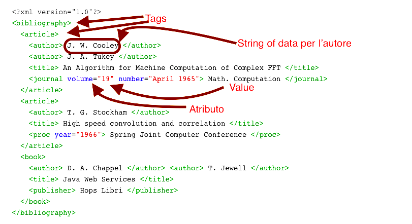

## Schema concettuale di un documento XML

Un **documento XML** include due aspetti:

- il _contenuto_ del documento,
- lo _stile di presentazione_ del documento.

Per _contenuto_ si intende inoltre la **sintassi **(organizzazione e formato dei contenuti) e la **semantica** (significato del contenuto).

Con i documenti **CSS** posso tenere separati il _contenuto_ dallo _stile_. In un documento XML il _contenuto_ può essere descritto in modo esplicito.


### Organizzazione logica di un documento XML

La struttura di un documento XML è piuttosto semplice: ogni *nodo* o *sotto albero* si chiama **elemento**, il quale può avere degli **attributi**. Tutti gli elementi devono contenere dei **dati**. Per esempio:

```xml
<!DOCTYPE simple SYSTEM “simple.dtd”>
<elemento1>
  <!-- Questo è un commento -->
  <elemento2 attributoX="45">
    Dato A
  </elemento2>
  <elemento3 attributoY="May 1988">
    Dato B
  </elemento3>
</elemento1>
```

Un documento XML può contenere anche altre componenti, quali:

- **dichiarazioni**, ad esempio: `<!DOCTYPE simple SYSTEM “simple.dtd”>`  può essere inclusa.
- **istruzioni di processing** per processare i dati simile al html.
- **commenti**, ad esempio. `<!-- Questo è un commento -->` nello stesso formato del html.

La corrispondente rappresentazione concettuale di tale documento è:


Inoltre un documento XML ha un'organizazione fisica e logica. E sono in qualche modo collegate.

**Logica vista:**

Ogni documento parte da un nodo chiamato **root**. Quindi si ha una root, poi ogni nodo ha degli attributi. Il dato finale è associato sia all **atributo** che al **nodo**.


### Organizzazione fisica di un documento XML

I documenti XML vengono distribuiti sotto forma di files chiamati **entità** (**entities**). Un'entità può fare riferimento (includere) altre entità, quindi si parla di *modularizzazione XML*. In questi casi, si individua una **entità radice** (**root entity**) la quale include le sotto entità a cui fa riferimento.

Per semplicità in questo corso considereremo solo entità semplici e indipendenti.

In altre parole se il documento è memorizzato in più files allora l'organizazione logica ha una singola root con un singolo albero. Ma i dati vengono seperati in più files (pysical files). Questi files vengono chiamati **entity**. Quindi si ha un main entity (chiamato document entity) che punta ad altre entità in file separati. 


### Sintassi generale di un documento XML

La sintassi di un documento XML segue la sintassi generale SGML. Un documento XML è ben formato se esso segue le regole generali SGML e obbedisce ad alcune regole aggiuntive. Le regole principali sono:

- ciascuno elemento _non vuoto_ deve essere delimitato da un **tag iniziale** e un **tag finale**.
- c'è **un solo** elemento radice che contiene tuttli gli altri
- i valori degli attributi sono sempre racchiusi tra **apici**
- i nomi degli attributi devono essere unici all'interno di ogni elemento (si noti che XML è case-sensitive)


### Strutture sintattiche XML

Il principio di ogni documento XML è che i **dati** sono una sequenza di caratteri e sono caratterizzati da dei **markups**, i quali possono essere:

- i **tag delimitatori** (ad es.: `<elem>...</elem>`)
- il riferimento ad una entità
- un commento
- una dichiarazione DTD
- una dichiarazione XML
- una istruzione di processing


**Esempio**

 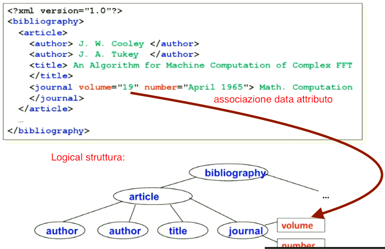


**Analisi**

La bliografia contine un articolo il quale contiene degli attori, un titilo e un giornale. Quest'ultimo il giornale ha dei attributi che sono associati a dei dati.


### Markups specifici di XML

#### Le dichiarazioni XML

Tutti i documenti xml iniziano con un prologo (che non è obbligatorio) che contiene la dichiarazione xml, la Document Type Declaration che contiene la definizione del Document Model (se si vuole ottenere un documento valido oltre che ben formato) ed un set di dichiarazioni, a questi segue l’elemento radice del documento.

La dichiarazione xml rispetta la seguente sintassi:

```xml
<?xml version="..." encoding="..." standalone="..." ?>

...
```

e comunica al processore xml:

- la versione di XML utilizzata mediante l’attributo version
- la codifica di caratteri utilizzata mediante l’attributo encoding
- se ci sono altri file da caricare (entità esterne o DTD) mediante l’attributo standalone


#### Le dichiarazioni DTD

La document type declaration permette di indicare DTD esterne, eventuali definizioni di entità e l’elemento radice del documento XML: la Document Type Definition in particolare viene utilizzata durante la fase di validazione mediante un confronto fra il documento xml ed il modello di riferimento descritto dalla DTD.

La document type declaration rispetta la seguente sintassi:

```xml
<!DOCTYPE element root
uri della DTD
[

...

dichiarazioni...

...

]>
```

in cui è possibile definire l’elemento radice, l’uri della DTD associata al documento ed una serie di ulteriori dichiarazioni (di entità o parti di DTD) utilizzate all’interno del documento stesso.


### Validità di un documento XML

I documenti XML possono essere:

- ben formati quando rispettano un insieme minimo di regole: non ci sono limitazioni sui tag che possono essere utilizzati e su come questi sono posti in relazione fra loro.
- validi quando oltre ad essere ben formati rispettano un modello ovvero una serie di regole che definiscono i tag utilizzabili, le relazioni fra questi, l’ordine con il quale appaiono all’interno del documento, gli attributi che possono contenere ...

Affinché un documento possa essere dichiarato valido occorre che il processo di validazione del documento secondo un determinato modello non restituisca errori.

Attualmente esistono due modi per definire il Document Model associato ad un documento XML:

- mediante una DTD (Document Type Definition) che definisce quali tag possono essere utilizzati e cosa possono contenere e se devo avere o no un elmento (ad esempio).
- mediante XSD (Xml Schema Definition) che è a sua volta un documento XML (rispetta quindi un determinato modello) che permette di definire dei template.

Qualsiasi linguaggio di markup che viene creato utilizzando delle regole xml costituisce un’applicazione xml (ad esempio XHTML).

In altre parole (in soldoni) per avere un documento XML valido, esso deve seguire le specifiche che si trovano nel DTD.

In alcune applicazione non c'è bisogno del DTD file per XML.

Il DTD è assai molto lasco per specificare delle regole sta di fatto che non si può dire ad esempio se un certo dato è un intero o altro.


## DTD

Il DTD è una sequenza di regole che descrivono componenti come _elementi_, _dichiarazioni_ e _dichiarazioni di attributi_. Le regole, come già detto, seguono la sintassi SGML con alcune restrizioni ed anche delle estensioni.

Le regole si dividono in due grossi insiemi:
1) regole che si riferiscono ad un elemento.
2) regole che si riferiscono ad un attributo.


Un file DTD inizia con `<!DOCTYPE name DTD>` In questo caso si sta dicendo che il documento è un DTD e la root è  `name`  quindi ad esempio:
`<!DOCTYPE simple SYSTEM “simple.dtd”>` si vuole dire che la root si chiama `simple`e che si ha un esterna definizione  e la parola `SYSTEM` significa `private` ossia non è in dominio publico e di solito si usa la parole `system` quando si vuole fare riferimento a documenti DTD che sono in locale, quindi la ULR per quel file non è una URL pubblica.

Se invece il DTD è pubblico si deve usare la parola `PUBLIC` come in questo caso:
`<!DOCTYPE HTML PUBLIC “-//W3C//DTD HTML 4.01//EN” “http://www.w3.org/TR/html4/strict.dtd”>`

E quindi i può inoltre inserire una riga per dichiarare a che cosa si riferisce il documento:
`<!DOCTYPE HTML PUBLIC “-//W3C//DTD HTML 4.01//EN” “http://www.w3.org/TR/html4/strict.dtd”>`

Le due stringe significano respitivamente:

1) `“-//W3C//DTD HTML 4.01//EN”` è il nome pubblico del DTD.

2) `“http://www.w3.org/TR/html4/strict.dtd”`è la URL di dove si trova il file.

Un altro modo è di avere un interna definizione. Ossia il DTD text è incluso dentro al DOCTYPE tag:
`<!DOCTYPE simple [ <!ELEMENT item (#PCDATA)>]> >`

E c'è una sola regola che specifica il DTD ossia:
`<!ELEMENT item (#PCDATA)>`


### Esempio di DTD numero 1

 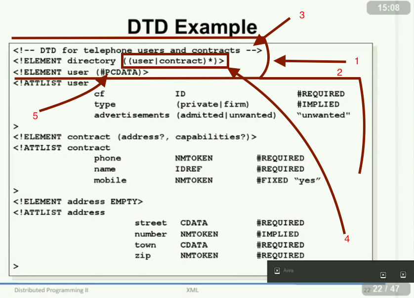


In questo caso si ha:

1) Element rules all'inizio del documento

2) Regole per gli attributi che iniziano con `ATTLIST`.

3)Ovviamente la prima riga è un commento.

 4) Ogni elemento viene specificato come viene chiamato e ad esempio si ha che nella seconda riga che l'elemento viene chiamto `directory` e a lato al il "contect model"  ossia `((user|contract)*)`Ossia quello che ci si aspetta dentro l'elemento. E più specificatamente significa qualche cosa con una sorta di espressione regolare. In questo caso dentro a `directory element`si ha ` user` o `contranct`element e questi possono essere ripetuti più volte a cause del simbolo `*` (zero o più elementi). Quindi si può avere 0 o 1 o più `user `oppure 0 o 1 o  più `contract `.

5)`#PCDATA` sinifica che dentro l'elemento si ha solamente del testo.


In agggiunta si possono anche dire se è obbligatorio inserire un elemento oppure no  `#REQUIRED`.

### Esempio di DTD numero 2

```xml
<!DOCTYPE NEWSPAPER [

<!ELEMENT NEWSPAPER (ARTICLE+)>
<!ELEMENT ARTICLE (HEADLINE,BYLINE,LEAD,BODY,NOTES)>
<!ELEMENT HEADLINE (#PCDATA)>
<!ELEMENT BYLINE (#PCDATA)>
<!ELEMENT LEAD (#PCDATA)>
<!ELEMENT BODY (#PCDATA)>
<!ELEMENT NOTES (#PCDATA)>

<!ATTLIST ARTICLE AUTHOR CDATA #REQUIRED>
<!ATTLIST ARTICLE EDITOR CDATA #IMPLIED>
<!ATTLIST ARTICLE DATE CDATA #IMPLIED>
<!ATTLIST ARTICLE EDITION CDATA #IMPLIED>

<!ENTITY NEWSPAPER "Vervet Logic Times">
<!ENTITY PUBLISHER "Vervet Logic Press">
<!ENTITY COPYRIGHT "Copyright 1998 Vervet Logic Press">

]>
```


### Dichiarazione di un elemento

La **dichiarazione di un elemento** si scompone in **nome dell'elemento** e in **modello del contenuto**. La _sintassi_ è la seguente:

```xml
<!ELEMENT nome_elemento modello_contenuto>
```

Le tipologie di modelli possono essere:

- **EMPTY**: vuol dire che l'elemento deve essere vuoto,
- **ANY**: non viene effettuato alcun controllo sul contenuto dell'elemento, qualsiasi cosa andrà bene,
- **Element**: significa che tale elemento dovrà contenere a sua volta altri elementi (relazioni),
- **Mixed Content**: tale elemento potrà contenere indifferentemente sia dati che altri elementi.


### Modelli di elementi

Grazie ai modelli degli elementi possiamo definire con una grammatica molto semplice il **nome**, **ordine**, **opzionalità** e **molteplicità** degli elementi annidati. Un modello può essere tre cose:

- un _elemento_
- una _sequenza di elementi_ (separati da una virgola)
- un'_alternativa di modelli_ (identificata con una barra verticale)

La **molteplicità** può essere specificata usando gli operatori con la notazione postfissa:

- `+` indica che il modello ha un'occorrenza di una o più volte
- `*` indica che il modello ha un'occorrenza di nessuna o più volte
- `?` indica **opzionalità**, cioè che può essere presente _nessuna_ o _una volta sola_ (c'è o non c'è).


Inoltre si possono usare le parentesi per ragruppare in sotto gruppi e fare cose più complesse.


### Esempi di modelli di elementi

Un esempio di DTD che utilizza modelli semplici:

```xml
<!ELEMENT meal (course*)>
<!ELEMENT course (first|second|dessert)>
<!ELEMENT fixedPriceMeal (first,second,dessert)>
<!ELEMENT first EMPTY>
<!ELEMENT second EMPTY>
<!ELEMENT dessert EMPTY>
```

L'elemento `course` può essere uno o più dei tre specificati (ossia può essere `first`o `second`o `dessert`). Mentre l'elemento `meal` può essere presente 0, 1, 2, 3… volte e così via.

L'elemento ha senso dichiararlo vuoto quando si associa l'informazione all'attributo. Quindi si ha un elemento vuoto ma esso è un attributo. 

Questo è un esempio di DTD in cui c'è un elemento con modelli composti:

```
<!ELEMENT laboratory ( name, location, secretary?, (technician|operator)+)>
```

L'elemento `laboratory`include una senquenza di elementi: `name`element, ecc..

Ossia

L'elemento `laboratory` ha una sequenza di attributi, dei quali `secretary` è opzionale e può avere uno o più tra `technician`oppure `operator`. In altre parole, nel linguaggio umano, diremmo:

> In un **laboratorio** di nome __name__ che si trova in __location__ può esserci come non esserci una __segretaria__. Ma deve avere un gruppo di soli __operatori__ o di soli __tecnici__, oppure un solo __operatore__ o un solo __tecnico__.


### Mixed models

Nei modelli misti, possono essere specificati solo i nomi degli elementi ammessi ma non viene specificato nulla circa il loro ordine (non sequenzialità) e sulla loro molteplicità e questo è un limite per i DTD. Per cui, l'unica forma ammessa nei **mixed models** è la seguente:

```xml
(#PCDATA | name1 | name2)*
```

##### Esempi

```xml
<!ELEMENT onlyData (#PCDATA)>
<!ELEMENT DataAndFonts (#PCDATA | font)*>
<!ELEMENT DataFontsAndColors (#PCDATA | font | color)*>
```


`#PCDATA` significa che è possibile usare qualsiasi dato.

### Dichiarazione di attributi

Ciascuna dichiarazione specifica una caratteristica di uno o più attributi su di un tipo di elemento. La sintassi è simile a quella vista per i **models**:

```
<!ATTLIST nome_elemento lista_attributi >
```

Per ciascun attributo posso specificare: **nome**, **tipo di valore** e ***dichiarazione di default***. Ad esempio:

```
<!ATTLIST	solo_dati
			id		ID				#REQUIRED
			type	(vector|matrix)	"vector">
```

Più in particolare si ha:

- `id` ,`type` : sono i nomi degli attributi,

- `ID`, ` (vector|matrix)` : sono il tipo degli attributi

- `#REQUIRED`: sono opzionali e specificano altre cose.

  ​

### Specificare il tipo dei valori


Più in particolare si ha:

- String: sono le stringhe

- Token: Sono delle parole e quindi sequenza di caretteri senza  spazio. I singoli token sono:
  `ID`, `IDREF`, `ENTITY` e ` NMTOKEN`.   Poi si hanno degli altri token che corrispondono a delle sequenze di token :  ` IDREFS`,` ENTITIES` e ` NMTOKENS`.

  - `ID` significa  che il valore dell'attributo è usato come un unico identificatore.
  - `IDREF` è collegato a `ID ` significa che il valore dell'attributo è un link (reference) ad un elemento attraverso un identificatore univoco.
  - `ENTITY`è un altro link e si collega ad una entità.
  - `NMTOKEN`è un generico token senza speciali significati.

  - `IDREFS`,`ENTITIES` e `NMTOKENS` si usano quando si hanno delle sequenze dei primi (
    `ID`, `IDREF`, `ENTITY` e ` NMTOKEN`).

- `ENUMERATION` si può specificare cosa si può mettere in questo elemento come nella tabella ad esempio è possibile mettere solo `MR` o `MRS` o `Miss` altri valori non sono ammessi.

  ​

### Significato dei vari tipi di *tokens*


### Dichiarazioni di default

Ci sono quattro modi per dichiarare se un attributo può essere obbligatorio (richiesto) oppure quale sia il suo valore di default:

- `#REQUIRED` indica che l'attributo è obbligatorio ma non viene indicato un valore di default.
- `default` l'attributo è opzionale; nel caso in cui non sia stato specificato, allora viene utilizzato un valore di default.
- `#IMPLIED` l'attributo è ancora opzionale e il suo lavore non è definito. Potrà essere utilizzato qualsiasi valore nel caso in cui l'attributo sia assente.
- `#FIXED default` anche qui l'attributo è opzionale, ma se definito sarà non modificabile: nel senso che c'è un valore di default che può essere solo quello, ma se voglio posso non mettere nulla.


### Esempio

```
<!ATTLIST	course
			code	ID	#REQUIRED
			name	CDATA	#IMPLIED
			double	(yes|no)	"no"
>
```

Dunque, secondo questo schema, potrei scrivere:

- ```<course code="A10" name="spaghetti">```
- ``````<course code="A10" double="yes">```
- `double`è assente quindi viene preso il valore di defualt che in questo caso è "no".

invece non sarebbero validi, per esempio, le seguenti dichiarazioni:

- ```<course name="Steak">``` _(manca l'attributo **code**!)_
- ```<course code="A10" double="nes">``` _(il valore **nes** per l'attributo **double** non è tra quelli selezionabili!)_
- ```<course>``` _(l'elemento **course** deve avere almeno l'attributo **code** definito!)_


## Esercizio

Testo:

Write a DTD describing the structure of documents that can store the data of a bank account, using the following rules: 

– Each account is characterized by 
• One and only one account number
 • One or more account holders 
• A sequence of operations, grouped by year 
– Each operation is characterized by 
​	• date and amount 
and, optionally, by a description 
– Each account holder is characterized by 
• a name and an address

Soluzione:

Passo 1: Creare un albero

 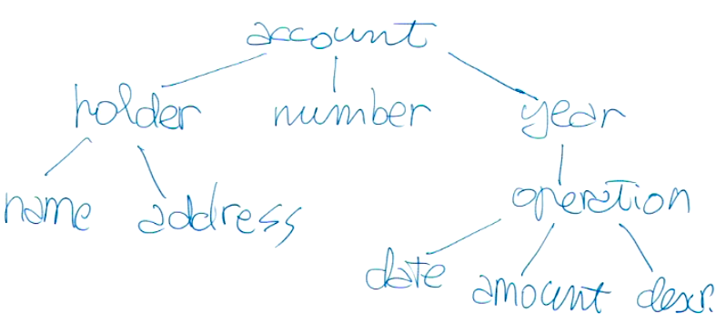


Passo 2: Mettere la molteplicità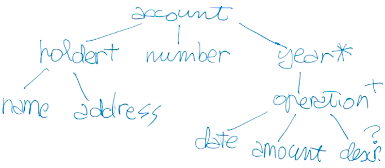


Passo 3: Decidere se sono elementi o attributi 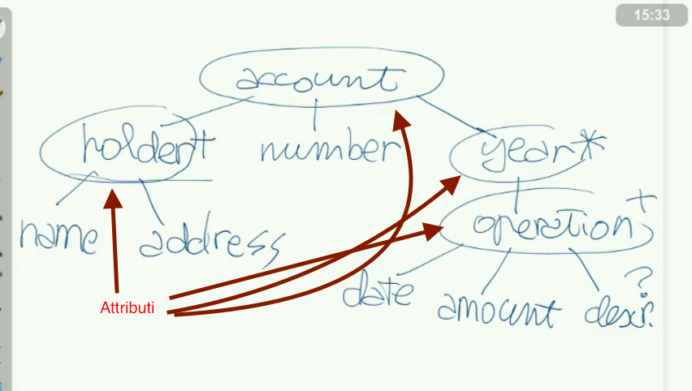


Passo 4: Decidere il tipo se è un ID o altro ad esempio.

Passo 5: Scrivere il file se guendo il disegno:

```
<!DOCTYPE data_bank_account [
	<!ELEMENT account 	(account_number, holder+, operation(year, ...))>
	<!ELEMENT operation (date, amount, description?)>
	<!ELEMENT holder	(name, address)>
]>
```


Se si prende un file XML e lo si mette in un browser (come ad esempio firefox) non si vedrà il file cosi com'è ma bensi un file strutturato dall'applicazione:

 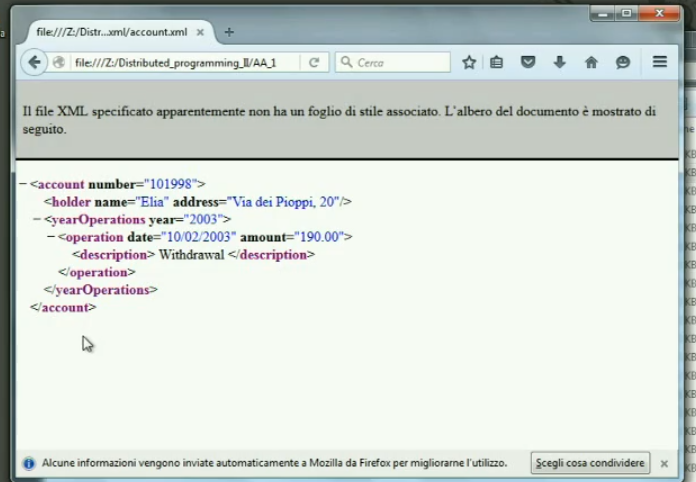


Il file DTD della figura sopra:


 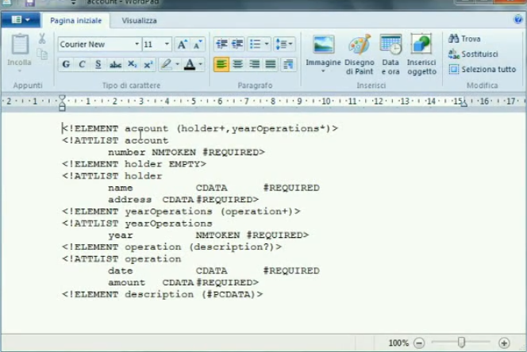


Da notare che `<holder name=… />`che `holder`finisce per un `/`quindi è un empty element. E dentro ad esso non c'è nulla a parte gli attributi.

**Esercizio da fare a casa**

 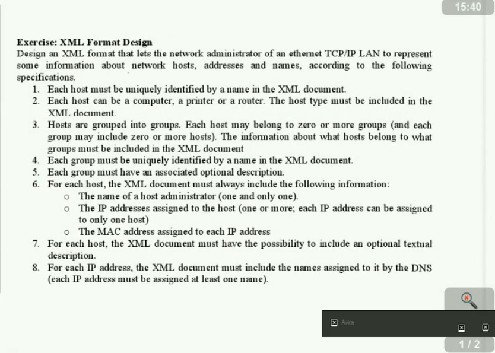


**Possibile soluzione:**

Struttura base


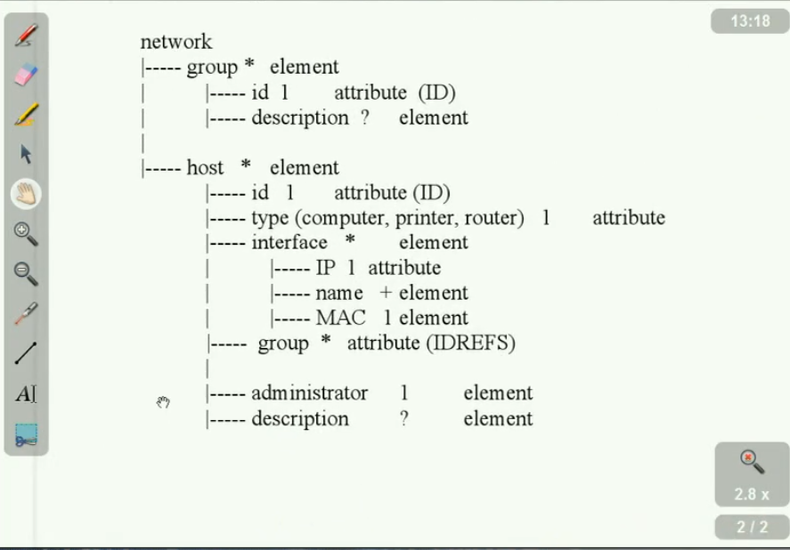

In questa soluzione si ha una root la quale contiene due elementi: `group`e `host`

Nel `group`si ha sia un `id`  e una descrizione che può essere opzionale. Nel `host` si ha un `id`"che viene puntato" dal `id` del `group`. Ossia `group` (del host) contiene un link a `group id`.  Come si può vedere nella figura sottostante: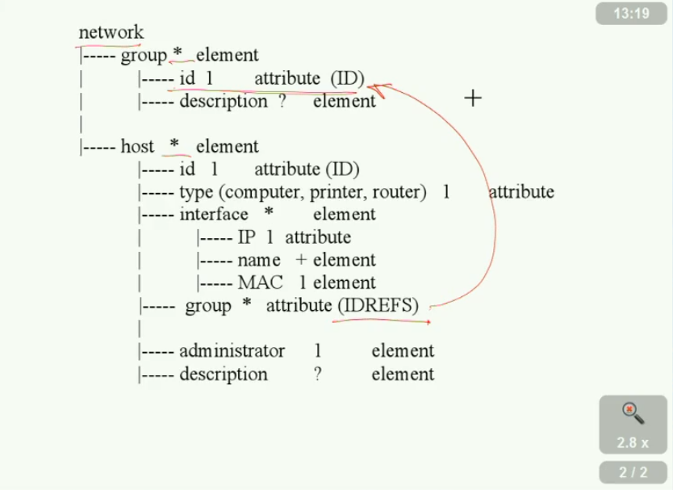


Inoltre ci sono anche altre informazioni come ad esempio la scheda MAC che deve essere pari a 1 e cosi via.

L'interfaccia dell host può essere sia 0 che più 1,2,3, ecc… questo perché alcuni pc potrebbero non avere di interfaccia.

Si poteva anche (come possibile soluzione con i suoi pro e contro) togliere interfacia dell host e metter i suoi elementi dentro a host.

Nel DTD c'è una limitazione ossia che se nel documento ci sono die ID come in questo caso (uni per il gruppo e l'altro per l'host ) ossia per il linguaggio DTD c'è un unico scope per il `unique ID` per tutto il documento. **Ossia non è possibile avere un ID del host uguale ad un ID del gruppo.** Quindi se si usa un validatore per DTD andrà a confrontare questi due ID come se fosse un unico ID.

La cosa si ripercuote sul `group attribute`ossia essendo che va a puntare da qualche parte, il validatore non sa se deve puntare sul ID del host o del gruppo quindi per lui è tutto corretto se punta in uno dei due. 
Questa è una limitazione del linguagio DTD.  Tuttavia si possono fare ulteriori test  usando altri strumenti come "schema".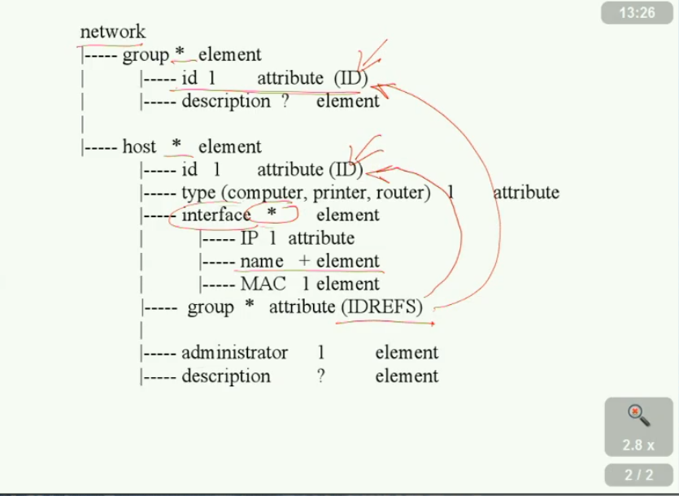


**Soluzione in DTD**

Nel `network`si ha sia il `group`che `host`i quali devono essere uno dietro l'altro tuttavia nessuno ci vieta di scrivere: `(group|host)*`quindi si avrebbe o un host o un gruppo con una multiplicità pari a 0 fino a n.

Si può vedere che qui c'è un'incongruenza con quello visto prima ossia `interface` del host ha una multiplicità indicata con il `+`mentre prima era indicata con `*`.

NMTOKEN non è un token unico ma c'è ne potrebbero essere altri nel documento uguali.

Se si volesse che ci fosse un solo unico indirizzo Ip per ogni macchina allora si dovrebbe insirire un nuovo vincolo nel DTD. Tuttavia ID per i DTD iniziano con una lettera quindi si avrebbe dei problemi.


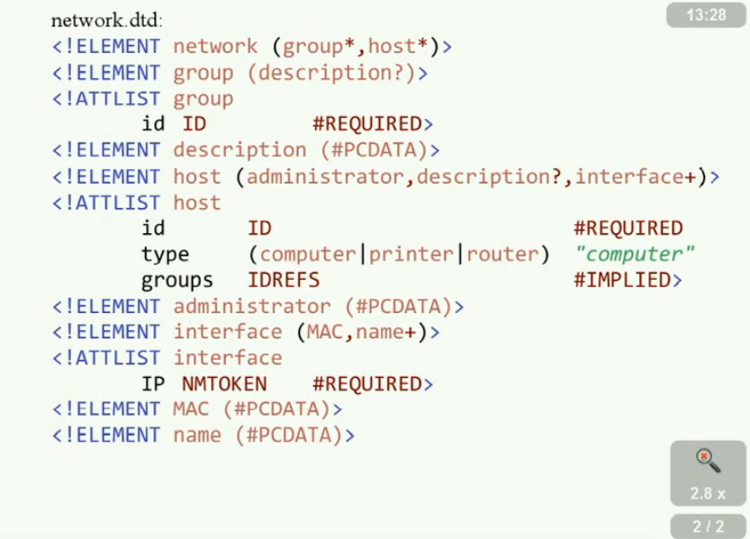


**Come viene processato un documento XML?**

La seguente figura mostra lo schema _generico_ di elaborazione di un documento XML:

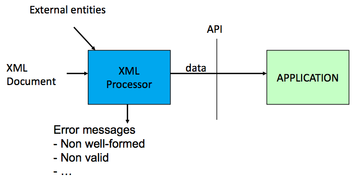

Di solito si legge e si scrive un XML document per passarsi delle informazioni. Per fare ciò si ha un XML processor esso può essere ad esempio una libreria. Inoltre offrono sia la parte di lettura che di scrittura dei dati. Per lettura si intende quando si decodifica un XML ossia si estrae le informazioni. Mentre per scrittura si intende quando si serializa le informazioni.

Quindi si ha che il file XML arriva al processore XML e viene decodificato e passato all API che lo passa all'aplicazione.

Se XML document non è valido allora di solito viene scartato. In questo caso (nella figura) si genera un error-message.

Le API sono importanti, perché vengono fornite dal sistema che sta utilizzando in quel momento l'XML. Per esempio, un server scritto in Java fornisce API diverse da un client che vuol tradurre l'XML in DOM magari scirtto in un altro linguaggio.

Ci sono due tipi di **XML processors**:

- *non validating processor*, chiamato anche *parser_, controlla solamente la corretta forma del documento,
- _validating processor_ controlla sia la corretta forma del documentosia la sua validità interna.

Il tool **msxml** è un esempio di *non validating processor*, mentre **JAXP** è un esempio di *validating processor*.

Ogni browser ha un processor XML per poter visualizare qualche cosa di carino. Inoltre se ci sono degli errori potrebbe comunicarceli e via discorendo.

Come sempio di applicazione si guardi le due figure successive:

 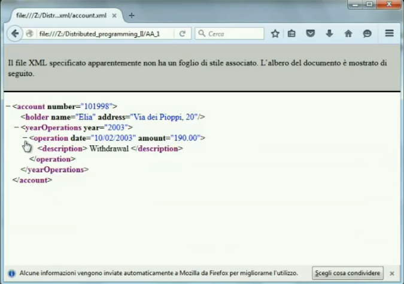

ma si può contrare:

 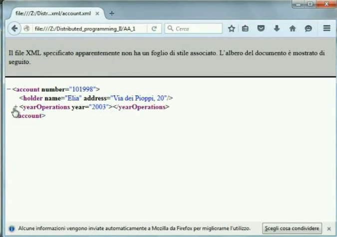


Questo perché il browser non solamente ha un parser ma ha anche un applicazione che capisce e ci va vedere qualche cosa di più carino.


Si può vedere il codice sorgente in questo modo:

 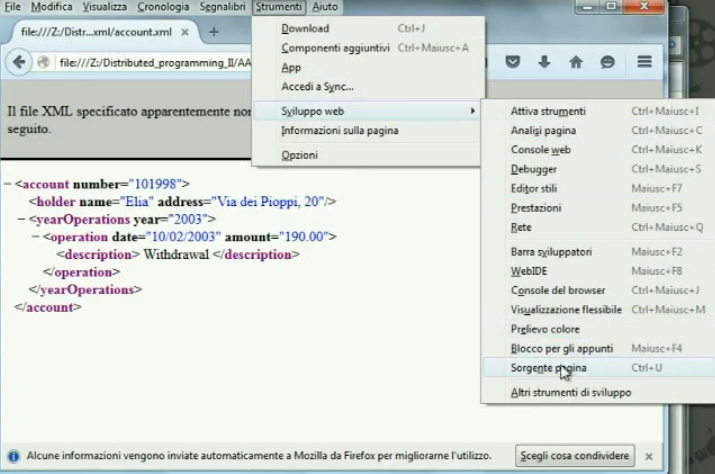


codice sorgente:

 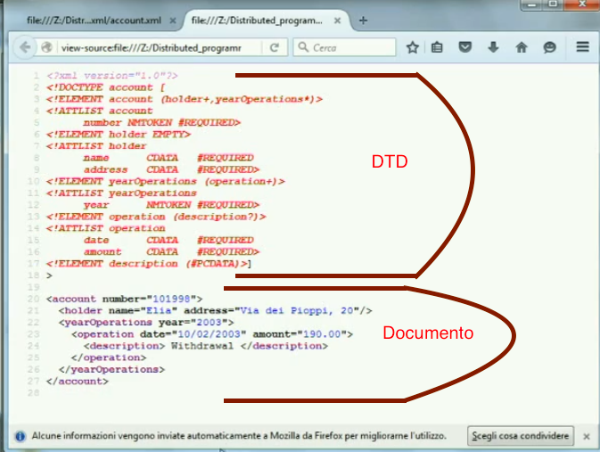


In questo caso non ci sono particolari informazioni per la visualizazione (esempio il colore) quindi è il browser che per sua bontà ci fa vedere qualche colore.

Tuttavia si vede come c'è sia il DTD del documento che il documento in se.


 


Ripartendo da questa figura si può dire che il  XML processor legge e scrive i documenti XML e si prende cura della validazione del documento. Di solito questo processore è configurabile e quindi si può dire quello che si vuole ossia se il documento è  "well formed" o se è valido.

Le applicazioni di solito leggono/scrivono le informazioni del XML processor attraverso una API.
Inoltre l'applicazione può dare degli ordine al processore XML come ad esempio se deve leggere e cosi via.

L'applicazione può prendere le informazioni che butta fuori il processore attraverso l'API.

**Si hanno degli standard: SAX, DOM e StAX**

#### SAX parsing

SAX è un'API di basso livello il cui principale punto di forza è l'efficienza.

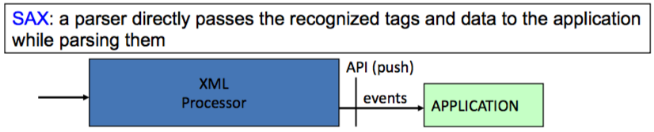

 Quando un documento viene parsato usando SAX, una serie di eventi vengono generati e passati all'applicazione tramite l'utilizzo di callback handlers che implementano l'handler delle API SAX. Gli eventi generati sono di livello molto basso e devono essere gestiti dallo sviluppatore che, inoltre, deve mantenere le informazioni necessarie durante il processo di parsing. Oltre ad un utilizzo piuttosto complicato, SAX soffre di due limitazioni di rilievo: non può modificare il documento che sta elaborando e può procedere alla lettura solo "in avanti": non può tornare indietro. Quindi, quello che è stato letto è perso e non è possibile recuperarlo e si dice `push the data to the application` .  In questo caso è il processore XML che guida  l'applicazione. L'applicazione mette a disposizione alcune API che vengon chiamate al generare di un evento dal  processore XML. 

#### DOM parsing

DOM, invece, ha come punto di forza la semplicità d'utilizzo. 

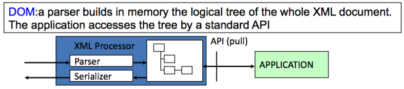

Una volta ricevuto il documento, il parser si occupa di costruire un albero di oggetti che rappresentano il contenuto e l'organizzazione dei dati contenuti. In questo caso l'albero esiste in memoria e l'applicazione può attraversarlo e modificarlo in ogni suo punto. Ovviamente il prezzo da pagare è il costo di computazione iniziale per la costruzione dell'albero ed il costo di memoria.

Di solito si dice `pull the data to the application` In questo caso è l'applicazione che guida il processore xml.

Esso viene usato per le pagine HTML.


Il DOM è molto flessibile  mentre il SAX è molto più veloce. Perché il DOM deve prendere l'informazione e memorizzarla in memoria, mentre il SAX non appena arriva l'informazione la può subito farci il parsing. Quindi il tempo di latenza nel SAX è molto più piccolo rispetto al DOM. Inoltre nel DOM poiché si può navigare nell'albero si ha bisogno di più tempo per fare tutte queste operazioni che non si hanno nel SAX.

#### StAX parsing

StAX è un pull parser e sta in mezzo ai due precedenti (DOM e SAX). 

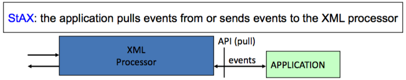

A differenza di SAX, che è un push parser, non riceve passivamente i segnali inviati all'handler per elaborarli, ma è l'utente a controllare il flusso degli eventi. Questo significa che il client richiede (pull) i dati XML quando ne ha bisogno e nel momento in cui può gestirli, a differenza del modello push, dove è il parser a inviare i dati non appena li ha disponibili a prescindere che l'utente ne abbia bisogno o sia in grado di elaborarli. Le librerie pull parsing sono molto può semplici delle push parsing e questo permette di semplificare il lavoro dei programmatori, anche per documenti molto complessi. Inoltre è bidirezionale, nel senso che oltre a leggere dati XML è anche in grado di produrli. Rimane il limite di poter procedere solo "in avanti" nell'elaborazione del documento XML.

Riassumendo si può dire che è simile all SAX per il pull ma è carraterizato dall'events base ossia come il DOM. Quindi il StAX può sia leggere che scrivere e non si ha nella memoria un albero come nel DOM. Quindi quando si leggono i dati si comporta similmente al SAX. Inolte è l'applicazione che chiede il prossimo "pezzo" di dato al processore XML.


## Document Object Model (DOM)

**DOM** ovvero: *modello a oggetti del documento*, è una forma di rappresentazione dei documenti strutturati come modello orientato agli oggetti.

DOM è lo standard ufficiale del W3C per la rappresentazione di documenti strutturati in maniera da essere neutrali sia per la lingua che per la piattaforma. DOM è inoltre la base per una vasta gamma di interfacce di programmazione delle applicazioni; alcune di esse sono standardizzate dal W3C.

#### Esempio con HTML

Un classico esempio di albero DOM è quello generato da un browser web nell'interpretazione di un documento HTML.

Il seguente documento HTML:

```html
<!-- My document -->
<html>
  <head>
    <title>My Document</title>
  </head>
  <body>
    = Header =
    <p>
      Paragraph
    </p>
  </body>
</html>
```

avrebbe il seguente albero DOM:


È da notare che in questo esempio anche i cosiddetti caratteri blank (spazi, tabulazioni, ecc.) sono considerati elementi dell'albero, nonostante questi non vengano poi mostrati dal browser (a meno che non si trovino all'interno di un tag `pre`).


### Caratteristiche

Nativamente supportato dai browser per modificare gli elementi di un documento HTML. DOM è un modo per accedere e aggiornare dinamicamente il contenuto, la struttura e lo stile dei documenti. Per le numerose incompatibilità dovute al diverso tipo di gestione di DOM dai vari browser, il W3C ha stabilito delle specifiche standard.

DOM non pone limitazioni alla struttura dei dati di un documento. DOM permette di visualizzare un documento ben formato sotto forma di albero: la maggior parte dei parser XML (come Xerces) e i processori XSL (per esempio Xalan) sono stati sviluppati per usare la struttura ad albero. Questa implementazione richiede che l'intero contenuto di un documento venga analizzato e salvato in memoria. DOM è utilizzato principalmente per recuperare informazioni da documenti con una strutturazione non standard, cioè dove gli elementi devono essere trovati in modo casuale. Per le applicazioni basate su XML che usano un processo di lettura e scrittura per analisi, DOM presenta un grande spreco di memoria; per questo tipo di applicazioni si consiglia di usare il modello SAX.


### Organizzazione delle specifiche del DOM

Le specifiche DOM elaborate da W3C sono suddivise in livelli, ciascuno dei quali contiene moduli obbligatori o opzionali. Per sostenere di appartenere ad un certo 'livello', un'applicazione deve soddisfare tutti i requisiti di tale livello e dei livelli inferiori. La specifica attuale di DOM è al Livello 2, tuttavia alcune delle specifiche del Livello 3 ora sono già raccomandazioni del W3C.

##### Livello 0

include tutto quello che viene fornito a DOM per la creazione del Livello 1, per esempio: document.images, document.forms, document.layers, e document.all. Nota, questa non è una specifica convenzionale pubblicata dal W3C ma piuttosto dà un riferimento a che cosa esisteva prima del processo di standardizzazione.

##### Livello 1

navigazione di un documento DOM e manipolazione del contenuto.

##### Livello 2

supporto al Namespace XML, viste filtrate e Eventi DOM. Incluso quindi elaborazione documenti CSS.

##### Livello 3

consiste in 6 specifiche differenti:

1. il nucleo del Livello 3;
2. caricamento e salvataggio del Livello 3;
3. XPath del Livello 3;
4. viste e formattazione del Livello 3;
5. requisiti del Livello 3;
6. validazione del Livello 3, che potenzia ulteriormente DOM.
7. ​

### Interfacce DOM di livello 1

### L'elemento <\<interface>>

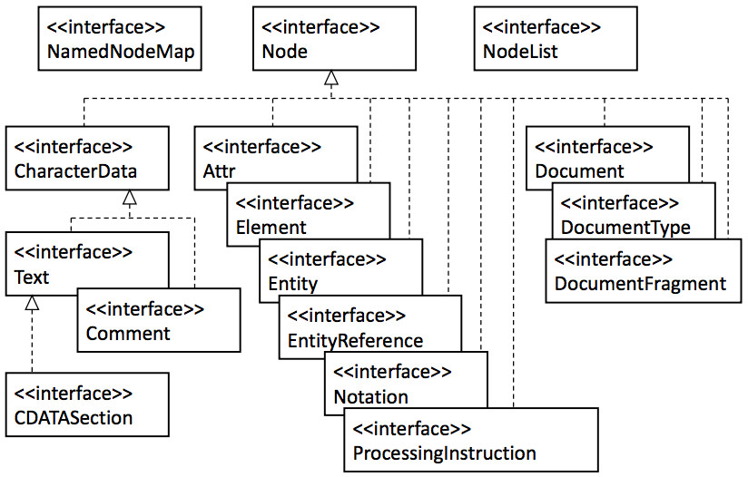

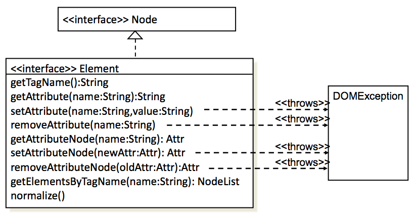


## Semplice API per XML (SAX)

Simple API for XML o SAX è un'API per numerosi linguaggi di programmazione che permette di leggere ed elaborare dei documenti XML.

Contrariamente al DOM, il SAX processa i documenti linea per linea. Il flusso di dati XML è unidirezionale, così che dati a cui si è acceduto in precedenza non possono essere riletti senza la rielaborazione dell'intero documento.

SAX fornisce un’interfaccia event-based per il pasring di documenti XML; il documento viene scandito sequenzialmente e viene generato un evento quando:

- inizia e finisce un documento
- inizia e finisce un elemento
- la presenza del contenuto di un elemento
- la presenza di Processing Instruction
- errori di sintassi XML di vario genere

Per ognuno di questi eventi occorre pertanto specificare le azioni da compiere: ovvero definire dei gestori che operino in risposta agli eventi generati.

Un’applicazione generalmente instanzia un parser, provvede a registrare i necessari Handler presso il parser stesso ed avvia l’elaborazione del documento XML.

Tipicamente SAX si utilizza quando:

- si stanno cercando pochi elementi
- la struttura del documento non è importante per l’applicazione
- non si stanno cercando elementi dipendenti dal contesto
- la risorsa memoria è critica


## API di tipo streaming per XML (StAX)

Queste API sono state sviluppate dopo le SAX. Se SAX è push parser, StAX è invece pull parser, cioè richiede gli elementi XML al parser solo quando servono, cioè all'accadere di certi eventi. Alcuni esempi di questi eventi sono:

- **setDocumentLocator** che indica l'inizio del parsing,
- **startDocument** che indica l'inizio di un documento XML
- **endDocument**
- **startElement** rappresenta l'inizio di un elemento XML
- **endElement**
- **characters** quando si sta leggendo del testo

StAX è comodo in quanto permette sia di **leggere** sia di **scrivere** dal/sul documento XML. Con SAX posso solo leggere. Per cui la programmazione risulta più semplice con StAX che con SAX.


## Confronto tra DOM/SAX/StAX

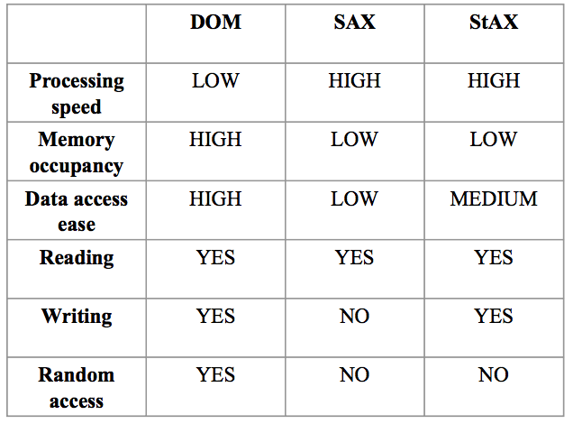


## Presentazione di un documento XML

La _presentazione_ (ovvero la _grafica_ detto beceramente) di un documento XML viene specificata separatamente utilizzando uno dei due modi:

- CSS: Cascading Style Sheet
- EXtensible Stylesheel Language (XLS)

Gli stili di rpesentazione vengono scritti su un documento a parte e poi inclusi all'inizio del file XML, ad esempio se ho due file di stile `mystyle.css` e `mystyle.xsl`potrò includerli nel seguente modo:

```
<?xml:stylesheet type=“text/css” href=“mystyle.css”?>
```

e l'altro:

```
<?xml:stylesheet type=“text/xsl” href=“mystyle.xsl”?>
```


## XSL: eXtensible Stylesheet Language

XSL è certamente uno dei più importanti linguaggi standard del W3C. Esso risulta composto di tre parti, ciascuna delle quali rientra nella specifica XSL 1.0, pu bblicata nell’ottobre 2001:

1. **XSLT**: è un linguaggio che consente di trasformare documenti XML in altri formati (vedi la Guida a XSLT di HTML.it)
2. **Xpath**: definisce espressioni e metodi per accedere ai nodi di un documento XML
3. **XSL FO** (Formatting object): usato per formattare in maniera precisa un oggetto trasformato


### Esempio di XSL

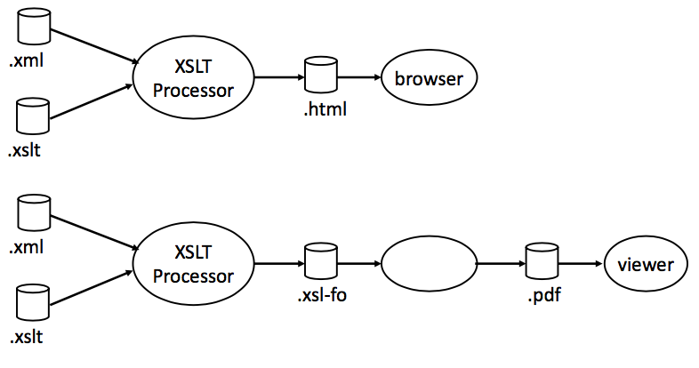

## XSLT

L'XSLT (eXtensible Stylesheet Language Transformations) è il linguaggio di trasformazione dell'XML, diventato uno standard web con una direttiva (Recommendation) W3C del 16 novembre 1999.

L'obiettivo principale per cui l'XSLT è stato creato è rendere possibile la trasformazione di un documento XML in un altro documento. Deriva direttamente dal linguaggio XSL, infatti i file di questo formato sono essenzialmente file di testo, contengono elementi ed attributi ed hanno l'estensione ".xsl".

Ci possono essere due casi specifici di trasformazione: da un documento XML a un altro documento XML (adatto a specifiche applicazioni), oppure da un documento XML ad un altro formato (ad esempio HTML, XHTML, WML e RTF, ma anche in qualsiasi altro formato di solo testo). L'XSLT può essere usato per entrambi i casi.

Per generare una trasformazione XSLT occorrono due file: il documento da trasformare (in XML) ed un documento contenente il foglio di stile XSL, che fornisce la semantica per la trasformazione. Il foglio di stile XSLT vede un documento XML come una serie di nodi strutturati ad albero. È formato da un insieme di modelli (template) che contengono le regole di trasformazione dei tag del documento XML. Nella sintassi XSL, i template sono elementi, a ciascuno dei quali corrisponde l'attributo match, associato al nodo che verrà trasformato. In termini strutturali quindi il foglio di stile XSL specifica la trasformazione di un albero di nodi in un altro albero di nodi.

È possibile anche aggiungere al documento trasformato elementi completamente nuovi o non prendere in considerazione determinati elementi del documento origine, riordinare gli elementi, fare elaborazioni in base al risultato di determinate condizioni, ecc.

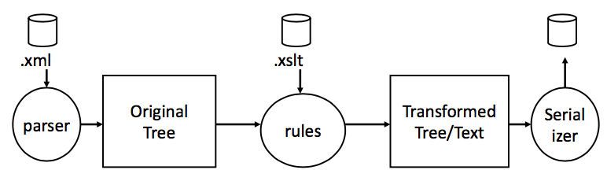

### Esempio di XSLT

```xml
<?xml version="1.0" encoding="ISO-8859-1"?> <xsl:stylesheet version="1.0" xmlns:xsl="http://www.w3.org/1999/XSL/Transform"> <xsl:template match="/">
  <html>
    <head><link rel="stylesheet" href="style.css"/></head> <body>
    <h2>My Articles</h2>
    <table>
      <tr>
        <th>Title</th>
      </tr>
      <xsl:for-each select="bibliography/article">
        <tr>
          <td><xsl:value-of select="title"/></td>
        </tr>
      </xsl:for-each>
    </table>
    </body></html>
  </xsl:template>
</xsl:stylesheet>
```

