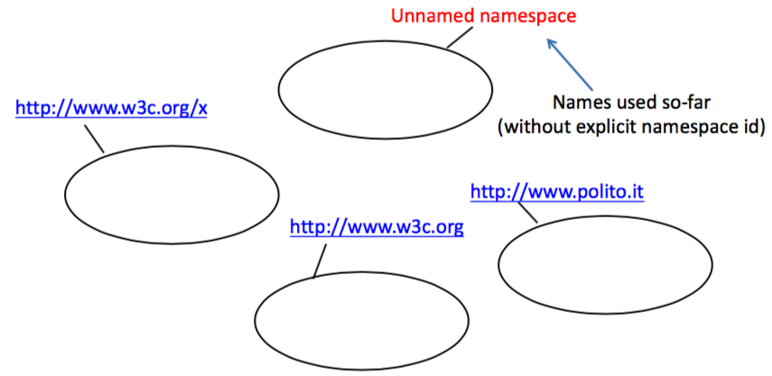
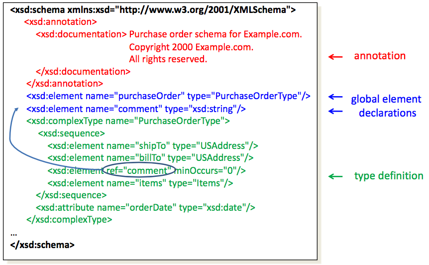
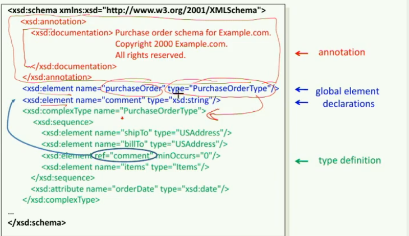
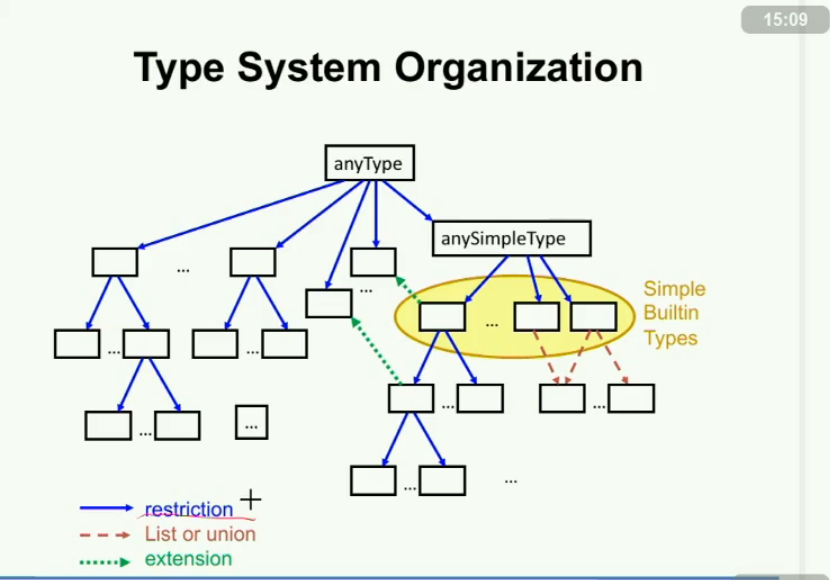
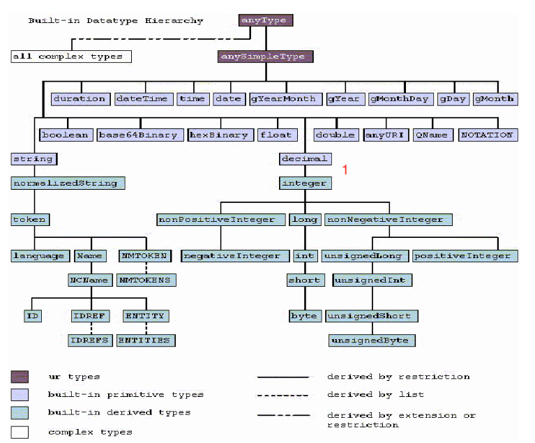
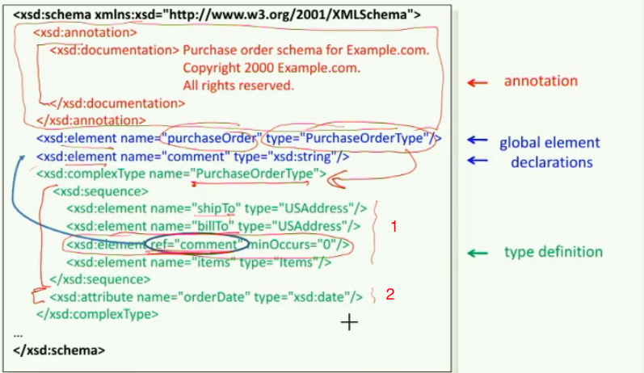
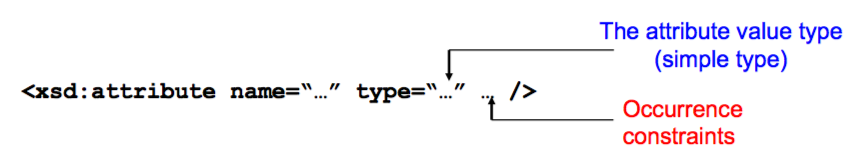
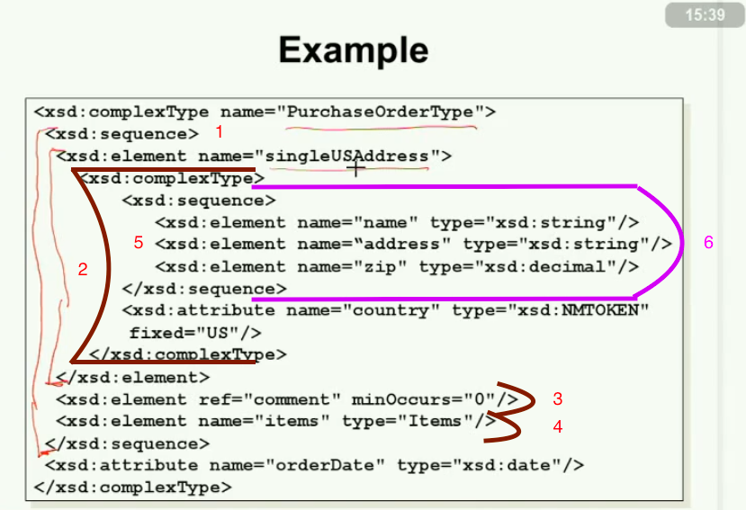
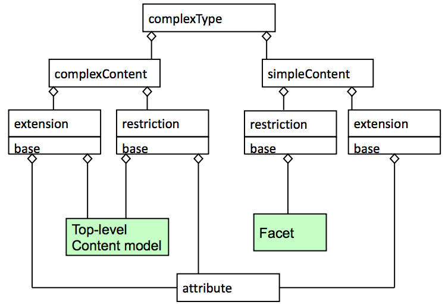
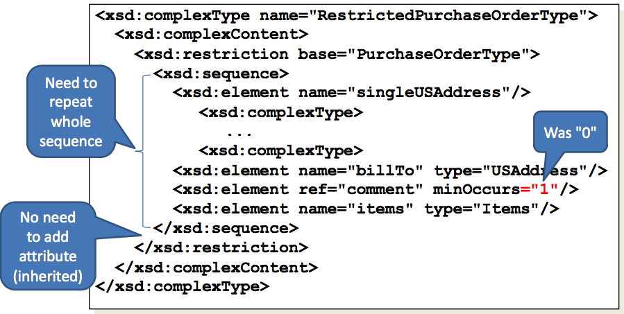

# 03 - XML Schema

In questa lezione vedremo gli **XML schema** e i **namespace XML**.

XML schema è un alternativa al DTD per specificare un linguaggio HTML o  applicazione HTML. E esso è molto più potente del DTD.


## XML Namespace

Il **namespace** è un raggruppamento di *nomi* posti sotto un unico *identificatore*. 

Il carattere chiave è il *colon* (**:**). 


### The problem

Uno dei grandi vantaggi di XML deriva dal fatto che esso è un *metalinguaggio*, cioè un linguaggio per creare altri linguaggi di markup. Questa caratteristica ci offre la libertà di crearci il nostro linguaggio lasciandoci decidere come vogliamo strutturare un documento e quali tag utilizzare.

Quindi, se voglio creare un mio linguaggio di markup per definire un mio documento non ho da fare altro che definire la struttura che voglio dare a tale documento e i tag da utilizzare.

Supponiamo che ad un certo punto mi rendo conto che mi venga comodo utilizzare un formato XML preesistente e volessi integrarlo in quello che sto già progettando, cosa succede? Nel caso più fortunato: nulla. Nel senso che ho scelto dei *nomi per i tags* che differiscono tutti dai *nomi per i tags* che sono già utilizzati nel formato XML che voglio integrare. Ma nel caso più sfortunato ho utilizzato un *tagname* che esisteva già nel formato XML che voglio importare. Il **parser XML** a questo punto non sarebbe più in grado di distinguere se *quel* tag faccia parte del mio formato XML oppure di quello che sto importando. 


### The solution

La soluzione più becera e meno ortodossa consiste nel cambiare i propri *tagname* in modo che non vadano in conflitto. Ma è una buona idea? No, perchè spesso non è facile prevedere che qualcun altro non riutilizzi in modo sbagliato il mio formato. Quindi si dovrebbero utilizzare i **namespace** che non sono altro che un identificatore (`mYnamespace`) da affiancare per mezzo di un colon `:` al nome del tag vero e proprio `color`, nel seguente modo:

```xml
<myNameSpace:color ...> ... </nyNameSpace:color>
<externXML:color ...> ... </externXML:color>
```

dove **myNamespace** e **externXML** sono i due nomi che ho scelto per distinguere i due **XML schemas** (uno il mio e l'altro importato).

Naturalmente vedremo come fare tutto ciò passo dopo passo, anche perchè qui non è stato spiegato come definire i due namespaces.


### Organizzazione dei namespaces

Ciascun **namespace** è un insieme di nomi univocamente definiti utilizzando un formato URI esteso (chiamato anche **IRI**). La seguente immagine fa vedere *quattro* namespace, dei quali tre hanno un nome definito (quelli che iniziano per `http://...`) mentre il quarto non ha un **namespace ID** definito:




I documenti `unnamed namespace`sono quei documenti usati fino adesso.

### Qualified names

Utilizzare nei nostri documenti XML direttamente ciascun **IRI** è davvero scomodo, si pensi a scrivere di fianco a ciascun *tagname* il relativo *IRI* che lo distingue: 

> *"Goodbye, John."*

Per cui si preferisce utilizzare un **identificatore locale** (una stringa ragionavolmente breve che rappresenti il namespace). *Locale* nel senso che sarà valido solo nell'XML Schema che sto scrivendo. Tale identificatore locale ha un nome tutto suo: **"QUALIFIED NAME"**.

Un *qualified name* può assumere due forme:

1. **forma prefissa** ad esempio `namespace1:tagname` e `namespace2:tagname`
2. **forma implicita** per esempio `tagname`, cioè il namespace non viene specificato e quindi si utilizza l'*unnamed namespace* (che sarebbe a dire il quarto senza nome nella figura sopra).


In altre parole si preferisce creare una dichiarazione  a cui è associatato il nome della URL. Ossia si scrive la URL una sola volta nella dichiarazione e poi si usa questa dichiarazione del documento.

In altre parole si usa un `small name` al posto della URL. E si crea una dichiacazione che è associatata al `short name` con la URL. Ossia si scrive una sola volta la URL nella dichiarazione  e poi si usa il `short name` nel documento.

Quindi va da se che `short name`viene denominato come:
`symbolic local identifier`.

**Ad esempio si potrebbe avere:**

`ns1:letter` dove `ns1`  è l'identificatore locale e `letter` è i nome. E vengono seperati dal "colon (`:`)".

Idem per : `ns2:letter`  e per `ns3:letter` ma hanno un qualificatore diverso. E quindi sono diversi.

Se invece  se si ha `letter` e quindi senza un prefisso allora il nome appartiene al default namespace.
Ovviamente nel documento si ha un defualt namespace che verrà poi associato a quel nome.


### Dichiarazione dei namespace

Per poter utiulizzare i *namespace* è necessario dichiararli (**namespace declaration**) e deve essere fatto sempre prima di ogni suo utilizzo nel documento, di solito le prime riche di uno schema XML definiscono i namespace.

La dichiarazione di un namespace viene fatta utilizzando un *attributo speciale*: `xmlns` (acronimo naturale di `XML NameSpace`) e può essere utilizzato in due modi:

1. come *identificatore locale simbolico* utilizzando quindi la forma prefissa, esempio: `xmlns:…` e quindi esplicito il nome da utilizzare per quesot namespace (al posto dei `…`),
2. utilizzando la forma implicita per dichiarare un *default namespace*, quindi specificando solamente `xmlns`.

Entrambe le forme comunque hanno un **nome** e un **valore**, facciamo due esempi:

1. `<section xmlns=“http://www.w3c.org”> ... </section>`
   dove: 
   - il *nome* (implicito) è **xmlns**
   - il *valore* è  **http://www.w3c.org**
   - In questo caso si é dichiarato il default namespace perché non si è usato il `:`.
2. `<section xmlns:ns1=“http://www.alpha.beta”xmlns:ns2=“http://www.alpha.gamma”> ... </section>` 
   dove:
   - i *nomi* (forma prefissa) sono **xmlns:ns1** e **xmlns:ns2**
   - i *valori* sono **http://www.alpha.beta** e **http://www.alpha.gamma**
   - In questo caso si è associato la URL con il symbolic name. Quindi  si è associato `ns1` e `ns2`  e quindi si potrà usare nel documento `ns1:letter` come visto prima. 


### Esempio pratico

```xml
01 <?xml version = "1.0"?>
02
03 <directory xmlns = "http://www.polito.it/xml/plain" 
              xmlns:image = "http://www.polito.it/xml/image">
04 
05  <file filename="book.xml">
06    <description>A book list</description>
07 </file>
08  
09  <image:file filename="funny.jpg">
10    <image:description>A funny picture </image:description>
11    <image:size width="200" height="100"/>
12  </image:file>
13  
14 </directory>
```

dove:

- ```xml
  ...
  <file filename="book.xml">
    <description>A book list</description>
  </file>
  ...
  ```

  indicano degli elementi specificati nel namespace di default **http://www.polito.it/xml/plain**


- ```xml
  ...
  <image:file filename="funny.jpg">
    <image:description>A funny picture </image:description>
    <image:size width="200" height="100"/>
  </image:file>
  ...
  ```

  indicano elementi specificati nel name space **image** ovvero in **http://www.polito.it/xml/image**

- alle riga 03 si dichiarano i default namespace e `image` namespace,


## XML Schema

La traduzione ~~schemi XML~~ è sbagliata, poichè **XML Schema** è un nome proprio che indica un linguaggio di descrizione del contenuto di un file XML, l'unico che finora abbia raggiunto la validazione ufficiale del W3C (la 1.1). In realtà ci sono vari linguaggio XML schema tuttavia in questo corso ne studieremmo uno solo.

Come tutti i linguaggi di descrizione del contenuto XML, il suo scopo è delineare quali elementi sono permessi, quali tipi di dati sono ad essi associati e quale relazione gerarchica hanno fra loro gli elementi contenuti in un file XML.

Ciò permette principalmente la convalida del file XML, ovvero la verifica che i suoi elementi siano in accordo con la descrizione in linguaggio XML Schema.

Lo XML Schema permette inoltre l'estrazione da un file XML, o meglio una visione da un file XML, di un insieme di oggetti con determinati attributi e una struttura. Questo approccio è stato fortemente spinto dalla Microsoft; alcuni critici lo contestano in quanto potrebbe introdurre dei punti di "legame" al sistema proprietario della Microsoft per l'accesso ai dati di un file XML.


Gli standard sono:

• Reference Namespace: http://www.w3.org/2001/XMLSchema

• Reference DTD (non-normative):
"-//W3C//DTD XMLSCHEMA 200102//EN""http://www.w3.org/2001/XMLSchema.dtd“

• Reference schema (auto-description): http://www.w3.org/2001/XMLSchema.xsd
Questo è "il reference".

• Tutorial (reference for study):
– XML Schema Part 0: Primer (W3C Recommendation)


### Struttura base di un XML Schema

La struttura base che permette di produrre un **XML Schema** è la seguente:

```xml
01<xsd:schema
                xmlns:xsd = "http://www.w3.org/2001/XMLSchema">
02
03  Annotazioni...
04  Elementi glocabli e dichiarazioni di attributi...
05  Tipi (dati/modelli) e definizioni di gruppi...

06</xsd:schema>
```

dove:

- 01 *schema* è per il linguaggio scelto che in questo caso è *schema*,
- *xsd* è un acronimo che sta per ***X**ml **S**chema **D**efinition*.
- xmlns:xsd = "http://www.w3.org/2001/XMLSchema" sarebbbe la dichiarazione del namespace. In questo caso il nome associato alla URL è xsd
- Dentro alla root element possiamo trovare in qualsiasi ordine: 
  - annotazioni (che sono delle annotazioni)  
  - elementi globali e dichiarazioni di attributi che sono simili agli attributi e elementi che si hanno nei DTD. Gli elementi globali sono accessibili da tutto il documento e si ha la possibilità di referenziare a questi elementi. Ad esempio si può assegnare un nome e "riprenderlo" attraverso il suo nome
  - tipo (dati/modelli)   e definizioni di gruppo. In questo caso è possibile creare la sua propria definizione simile a quello che si fa nei linguaggi di programmazione e di assegnare il nome a quel tipo. La defizione di gruppo possono essere considerate delle  macro definizioni e definisce i gruppi di dichiarazioni o di definizione che possiamo referenziare dal documento stesso.


### Esempio di XML Schema




- Nelle annotazioni ci sono vari elementi di vario tipo che sono differenti dalla "annotation" e più in particoalre una "documentation" è qualche cosa che è leggibile da un essere umano.

- `<xsd:element name="purchaseOrder" type="PurchaseOrderType"/>`  è una dichiarazione globale. Esso ha un nome `purchaseOrder`e un tipo `PurchaseOrderType` .  Il type include il "content model" e l'attributo dell'elemento che ha.

  - In verde si vede come `PurchaseOrderType` è collegato a`PurchaseOrderType` :	
  - 1 è il "content model". Si può notare che  `shipto` o come `billto` non è referenziabile in tutto in il documento.
    -  3 è l'attributo dell'elemento.				  	
  - 4 ->si può tuttavia referenciare grazie all'elemento globale `name="comment"`.
  - Inoltre gli elementi globali appaoiono nella root del documento.


### Tipi

I tipi sono simile ai linguaggi di programazione l'unica differenza è che nel XML Schema si ha una rapresentazione sotto forma di caratteri mentre nei linguaggi di programmazione si usa la rapresentazione binaria.

Se ad esempio si ha in integer in XML allora si hanno più modi per scriverlo:
`1` oppure `01`. 

Quindi nel linguaggio a caratteri si hanno molti modi per rapresentare qualchecosa. Ovviamente se si vuole fare dei confronti si dovranno fare in modo tale che tutto regga. Questa è in pratica l'unica differenza che c'è.

Non si ha delle cose molto stringenti ma si hanno delle regole sintattiche come ad esempio un intero è una sequenza di stringhe.

Si da ad un tipo un nome e un valore (stringa di caratteri).

I tipi semplici contengono un markup mentre quelli complicati non lo contengono. 

I tipi complessi descrivono il tipo degli elementi. Più in dettaglio dentro i tipi complessi si hanno gli atributi degli elementi e il contenuto dell'elemento.
Ad esempio un elemento può essere (come visto prima):
`<xsd:element name="purchaseOrder" type="PurchaseOrderType"/>`
Il quale ha sia il suo nome `purchaseOrder` e il suo tipo `PurchaserOrderType`. Esso quindi contiene il suo "content model" e possibilmente il suo attributo.

Il "complex type" o tipi complessi sono più generali rispetto al tipo semplice. Ossia il tipo semplice è un caso particolare del tipo complesso.

Le seguenti sono regole formali che definiscono i cosiddetti **tipi** di un XML Schema:


> I tipi sono strutturati secondo uno schema gerarchico simile a quello che si ha nei programmi ad oggetti. Tuttavia invece di avere il concetto dell'eredità, si hanno altri concetti. I quali sono chiamati  **restriction** e **extension**.


**Restriction** è una stringa (visto che i tipi sono stringhe alla fine) che è più "ristretta" rispetto all'originale. Ossia la stringa amessa è un sotto-insieme della stringa-originale.  Come si vede dalla freccia blu in cui sia ha un riferimento gerarchico in blu.


> Il tipo radice viene chiamato `anyType`. Corrisponde al DTD al  `any`. Ossia ogni stringa combacia con `anyType`. Ogni altra stringa è un sottoinsieme del `anyType` .


> La sotto gerarchia di un *tipo semplice* ha sempre come radice il tipo `anySimpleType`. Sarebbe la radice degli elementi semplici. Quindi si potrebbe dire che il graffo è diviso in due parti: a destra ci sono gli elementi semplici mentre a sinistra ci sono gli elementi complicati.


> Ogni *tipo semplice* può essere:
>
> - **built-in** cioè predefinito, oppure
> - **derived** cioè fatto derivare da un altro tipo semplice


> Ogni *tipo composto* (tranne `anyType`) può essere:
>
> - una **restriction** di un tipo semplice già definito in precedenza, oppure
> - una **extension** di un tipo semplice o di un altro tipo composto.


### Definite un tipo semplice

Come è già stato detto, un tipo semplice può essere **built-in** oppure **derived**. Se vogliamo definire un tipo *derived* possiamo farlo come una *restriction*, ovvero una ridefinizione di un altro tipo semplice (in modo esplicito) oppure come una *construction* attraverso i tipi **list** o **union**.

Una *definizione esplicita* è una definizione fatta utilizzando uno dei tre: *restriction*, *list* o *union*.

La seguente figura rappresenta la gerarchia di alcuni tipi predefiniti.




Si può vedere dalla figura sia tipi interi che tipi decimali (1) e cosi via.

Nel DTD si aveva il token (2) come qui che è sotto a stringa perché il token è una singola parola senza spazi.

Per essere compatibile con le tecnologie passate si sono inserite i loro tipi (3).

C'è anche la data (3).

Inoltre per i caratteri ci sono le varie rapresentazoini tra cui il base64Binary e cosi via. Come pure `anyURI`.

### Restricion, List e Union

Ora vediamo come possiamo definirei nuovi tipi in modo esplicito utilizzando *restriction*, *list* e *union*.


#### 1. Restriction

I valori dei tipi dichiarati attraverso una **restriction** appartengono ad un sottoinsieme del tipo di partenza sul quale sto facendo la *restriction* stessa.

La sintassi da utilizzare è la seguente:

```XML
<xsd:simpleType name:"...<!-- Qui ci va il nome del nuovo tipo che sto definendo -->">
  <xsd:restriction base:"... <!-- Qui ci va il tipo base da cui eredito -->">
    ... <!-- Qui ci va il "Facet" del tipo -->
  </xsd:restriction>
</xsd:simpleType>
```

Per esempio:

```XML
01 <xsd:simpleType name="myInteger">
02  <xsd:restriction base="xsd:integer">
03     <xsd:minInclusive value="10000"/>
04     <xsd:maxInclusive value="99999"/>
05   </xsd:restriction>
06 </xsd:simpleType>
```

**Sinossi**: ho creato un nuovo tipo esplicitamente (utilizzando la *restriction*). Il nuovo tipo si chiama **myInteger** ed eredita dal tipo predefinito **integer**. Il nuovo tipo *myInteger* può assumere solo i valori da *10000* a *99999*.  

La "Facet" sono i vincoli.

Se si mettono le righe 01 e 06 allora la definizione è referenziabile in tutto il documento.

 

#### 2. List

Non so se sarebbe giusto definirlo *array*, ma sembra essere così. La ridefinizione *esplicita* fatta attraverso una *list* ha come effetto quello di definire un tipo che rappresenta *una sequenza di dati del tipo di partenza*.

La sintassi è la seguente:

```xml
<xsd:simpleType name:"...<!-- Qui ci va il nome del nuovo tipo che sto definendo -->">
  <xsd:list itemType:"... <!-- Qui ci va il tipo da cui eredito -->"/>
</xsd:simpleType>
```

Esempio:

```xml
<xsd:simpleType name="ListOfMyIntType">
  <xsd:list itemType="myInteger"/>
</xsd:simpleType>
```

**Sinossi**: ho appena definitio un nuovo tipo di nome **ListOfMyIntType** che rappresenta una sequenza di valori tutti di tipo **myInteger** (che è stato definito prima), secondo la definizione fatta prima, ciascuno di questi valori sono compresi tra *10000* e *99999*.


#### 3. Union

Chi ragiona ancora in C può pensare alle *union XML* proprio come le union in C, vagamente simili alle struct.

In poche parole, quindi, le union in XML non sono altro che un particolare tipo di *list* nelle quali i tipi possono essere di tipo differente (nelle list i valori dei tipi sono tutti dello stesso tipo!).

Sintassi:

```xml
<xsd:simpleType name:"...<!-- Qui ci va il nome del nuovo tipo che sto definendo -->">
  <xsd:union memberTypes:"... <!-- Qui ci vanno i tipi dai quali eredito (separati ciascuno da uno spazio) -->"/>
</xsd:simpleType>
```

Esempio:

```xml
<xsd:simpleType name="IntegerAndDates">
  <xsd:list memberTypes="xsd:myInteger xsd:date"/>
</xsd:simpleType>
```

**Sinossi**: qui è stato definito un nuovo tipo di nome **IntegerAndDates** il quale è una sequenza di due semplici valori mixati come si vuole.

#### 3. Extension

E' per definire un nuovo tipo partendo da un'altro che esiste già. Ad esempio si può partire da un semplice elemento per definire un altro elemento (freccia verda). 


1)Definizione dell'elemento.
2) Definzione dell'attributo.

1)+2)=> è la defizione di un nuovo elemento complesso.




### Definizione dei tipi complessi

Si hanno diverse possibilità come ad esempio per mezzo di una diretta costruzione (come visto prima).

Oppure si può usare la "derivazione" con la "restriction" oppure con l "extensio".

### Il Facet dei tipi di dati

I tipi semplici (sia incorporati che derivati) presentano dei **facet**. Il facet è un singolo aspetto di definizione che contribuisce a determinare l'insieme di valori di un tipo semplice. Ad esempio, **length**, **minInclusive** e **maxInclusive** sono facet per i tipi di dati incorporati. Tutti i facet per un tipo semplice definiscono l'**insieme di valori validi** per quel determinato tipo semplice.

Il facet è definito come un **elemento**. Ogni elemento facet dispone di un attributo **fixed** rappresentato da un valore booleano. Quando si definisce un tipo semplice, è possibile impedire ai derivati di quel determinato tipo di modificare il valore di facet specificati. Affinché un facet non venga modificato, aggiungere l'attributo fixed al facet e impostarne il valore su true.

In una definizione del tipo i facet possono essere presenti **solo una volta**. Sono esclusi da questa regola i facet **enumeration** e **pattern**. I facet enumeration e pattern, infatti, possono avere più voci e sono raggruppati insieme.

I facet più comuni e importanti sono i seguenti:

- lenght
- minLenght, maxLenght
- pattern ossia la possibilità di usare delle espressioni regolari.
- enumeration
- maxExclusive, maxInclusive, minExclusive, minInclusive
- totalDigits, fractionDigits

Nei precedenti esempi abbiamo già incontrato (magari inconsapevolmente) l'uso di alcuni facets. Il seguente esempio mostra due tipi di dati personalizzati. Il primo creato con una **list** (*USStateList*) e il secondo con una **restriction** (*SixUSStates*). Il tipo *SixUSStates* deriva da *USStateList* ma ha una *restriction*: mentre in *USStateList* non c'è un limite al numero di stati che posso elencare, in *SixUSStates* posso speficare solamente *sei* stati:

```xml
<xsd:simpleType name="USStateList"> <xsd:list itemType="USState"/>
</xsd:simpleType>
<xsd:simpleType name="SixUSStates"> <xsd:restriction base="USStateList">
  <xsd:length value="6"/>
  </xsd:restriction>
</xsd:simpleType>
```


### Dichiarazione degli attributi

La dichiarazione degli attributi avviene secondo la seguente sintassi:

Dove nei puntini `…` indicati da *occurrence constraint* vanno specificati:

- `use`: indica se l'attributo è necessario (keyword: `required`) oppure opzionale (`optional`)
- `fixed`: indica se il valore specificato può essere variabile o è una costante (`false|true`)
- `default`: c'è un valore di dafault? Sì? Posso utilizzare questo *occurrence constraint* per indicarne uno.


#### Esempio

1. `<xsd:attribute name= "code" type=“xsd:int" use="required"/>`

   questo attributo è obbligatorio e non può essere omesso. Il tipo è un intero.

2. `<xsd:attribute name= "country" type=“xsd:string" fixed=“Italy"/>`
   questo attributo è fisso. Il tipo è una stringa.

3. `<xsd:attribute name= “length" type=“xsd:int" default=“0"/>` 
   in questo caso non è obbligatorio specificare l'attributo, se non lo farò allora verrà definito automaticamente con un valore di default pari a *0*.


### Content model

La *frequenza* e l'*opzionalità* possono essere specificate utilizzando i seguenti attributi:

- `minOccurs`: minimo numero di occorrenze, per esempio in un tipo *list*. Il suo valore di default è *1*,
- `maxOccurs`: massimo numero di occorrenza, il suo valore di default è ancora *1*,
- `default`: se l'elemento non ha un valore, ne viene impostato uno dal processore (quello specificato nel XML Schema)
- `fixed`: l'elemento **deve** avere questo attributo.


#### Esempi

```xml
<xsd:element name=“choice" type=“choiceKind” maxOccurs= “unbounded" />

<xsd:element name= “field" type=“fieldtype” default= “empty field“> ... <xsd:element/>
```

Con il termine `unbounded`  si intende che non c'è un limite superiore a questo elemento.


## Complex Types

I tipi **complessi** sono tipi di dati definiti dall'utente nei quali possono essere inclusi altri elementi o attributi ed elementi definiti come semplici o complessi. Nei tipi complessi possono inoltre essere presenti attributi e gruppi, mentre nei tipi semplici possono essere disponibili solo aspetti

I tipi complessi sono definiti mediante l'elemento **complexType** e in genere contengono combinazioni di dichiarazioni di elementi, attributi e gruppi nonché riferimenti a elementi e gruppi dichiarati globalmente. Un tipo complesso può essere considerato come uno schema ridotto, che consente di definire la struttura e i dati validi presenti in un determinato elemento.


Si parte dall'alto con il `complexType` e dentro ad esso (in modo agreggato) ci sono gli elementi dell'attributo  `attribute`.

Mentre il `Top-level Content model` può essere o un `Content model` oppure `all` .

Un `content model`può essere un `choice` o una `sequence`.  Tuttavia sia  `choice` sia  `sequence` contengono `Content model` in termini di `choise` o `sequence` .

In altre parole il graffo serve per sapere cosa sia lecito fare e cosa non sia lecito fare. Ovviamente nella realtà sarebbe molto più complicato.

#### Esempio 1

Uno scenario comune in cui utilizzare un tipo complesso è rappresentato da uno schema che consente di convalidare un ordine di acquisto richiedendo un indirizzo di spedizione e un indirizzo di fatturazione. In tale scenario viene definito un tipo complesso che rappresenta un indirizzo e vengono dichiarati gli elementi shipTo e billTo di tale tipo complesso.

Nell'esempio seguente verrà mostrato come creare un tipo complesso denominato usAddress:

```xml
<xsd:complexType name="usAddress">
   <xsd:sequence>
      <xsd:element name="name" type="xsd:string" />
      <xsd:element name="street" type="xsd:string" />
      <xsd:element name="city" type="xsd:string" />
      <xsd:element name="state" type="xsd:string" />
      <xsd:element name="zip" type="xsd:string" />
   </xsd:sequence>
</xsd:complexType>
```

Un elemento dichiarato con il tipo usAddress risulterebbe simile al seguente:

```xml
<xsd:element name="ShipTo" type="usAddress"/>
```

La keyword `sequence` significa che gli elementi devono comparire con quel ordine. 

#### Esempio 2

Nell'esempio seguente viene mostrato come dichiarare più elementi mediante il tipo complesso definito:

```xml
<xsd:element name="customerInfo">
  <xsd:complexType>
     <xsd:sequence>
        <xsd:element name="Name" type="xsd:string" />
        <xsd:element name="ShipTo" type="usAddress" />
        <xsd:element name="BillTo" type="usAddress" />
     </xsd:sequence>
  </xsd:complexType>
</xsd:element>
```


#### Esempio 3

Questo è ancora un terzo esempio in cui viene definito un tipo complesso:

```xml
<xsd:complexType name="PurchaseOrderType">
  <xsd:sequence>
    <xsd:element name="singleUSAddress">
      <xsd:complexType>
        <xsd:sequence>
          <xsd:element name="name" type="xsd:string"/>
          <xsd:element name="address" type="xsd:string"/>
          <xsd:element name="zip" type="xsd:decimal"/>
        </xsd:sequence>
        <xsd:attribute name="country" type="xsd:NMTOKEN" fixed="US"/>
      </xsd:complexType>
    </xsd:element>
    <xsd:element ref="comment" minOccurs="0"/>
    <xsd:element name="items" type="Items"/>
  </xsd:sequence>
  <xsd:attribute name="orderDate" type="xsd:date"/>
</xsd:complexType>
```


 

1) è il `content model` ed è una sequenza di `singleUSAddress` (2)

3) commento che è referenziato nella dichiarazione globale.  Da notare come `minOccours`  è pari a zero quindi essendo che il valore di default è zero e il valore minimo è zero, quindi si ha che il valore minimo è zero e che il valore massimo è 1.

4)Items è associato al tipo di attributo. Quindi è un `Items` definito a livello globale che è referenziato qui.

Quindi dentro a `PurchaseOrderType` si vuole avere un indirizzo, un  commento (3) e gli items.

5) è il "complex type definition" che in questo caso è anonimo. E dentro si hanno una sequenza di 3 elementi che caratterizzano l'indirizzo. I primi due sono due stringhe l'ultimo è un decimale.

Sotto invece si ha `country` che è un `MNTOKEN`, il quale in questo caso è fisso ed è `US`.

Inoltre si può notare come non ci sono dei vincoli (min, max) e quindi di default si ha 1. Quindi si ha un solo `name` e un solo `address` e un sono `zip`

### Special models

Ci sono dei *modelli* che vengono considerati *speciali*, tra questi ci sono quelli che hanno un **contenuto misto** e quelli che **non hanno un contenuto**.


##### Modelli a contenuto misto

Sono quei modelli in cui l'attributo **mixed** è impostato a *true* nella specifica `xsd:complexType`, il quale indica che nel testo (nel documento XML finale cioè) possono essere presenti due *sotto-modelli*.


##### Modelli senza contenuto

Sono del tipo:

```xml
<xsd:complexType name="internationalPrice">
  <xsd:attribute name="currency" type="xsd:string"/>
  <xsd:attribute name="value" type="xsd:decimal"/>
</xsd:complexType>
```

cioè vengono specificati omettendo semplicemente la descrizione del modello all'interno dell'elemento `xsd:complexType`.


### Modelli complessi derivati

Un tipo complesso può essere derivato **come estensione** oppure come **restrizione** di altri tipi.

Un *tipo complesso* può essere derivato **come estensione** di un tipo semplice. È facile: i nuovi attributi vengono aggiunti al modello base di partenza, ottenendo così il nuovo tipo complesso.

Un *tipo complesso* può essere derivato anche **come restrizione** di un tipo base, ovvero quest'ultimo viene "sottoposto" a delle restrizioni dei suoi *facets*, cioè il modello base di partenza viene così ridefinito.

La *derivazione* viene specificata introducendo un elemento **complexType** (oppure **simpleType**) all'interno di un elemento **complexType** già esistente.


### Tipi complessi derivati



<???>

E' il diagramma di classe che corrisponde a che cosa si può fare con le restrizioni. Il quale parte da `complexType` e si mette dentro ad esso `complexContent`  o  `simpleContent`  . Il primo (`complexContent`) se si vuole partire dal `complexType`. Idemo per il `simpleContent`se si vuole partire  dal `simpletype`.

La `restriction` è  possibile solo nel `simpleContent` e solo da li si può aggiungere un `facet`.

 

#### Esempio: l'estensione di un tipo semplice

Si consideri il seguente tipo:

```xml
<xsd:element name="internationalPrice">
  <xsd:complexType>
    <xsd:simpleContent>
      <xsd:extension base="xsd:decimal">
        <xsd:attribute name="currency" type="xsd:string"/>
      </xsd:extension>
    </xsd:simpleContent>
  </xsd:complexType>
</xsd:element>
```

<???>

`simpleContent` il quale estende `simpleType`. Inoltre `base` è un decimale.

Si va a estendere ` <xsd:attribute name="currency" type="xsd:string"/>` 

Una possibile vista è:

```xml
<internationalPrice currency="EUR">423.46</internationalPrice>
```


#### Esempio: estensione di un tipo complesso

```xml
01 <xsd:complexType name="Address">
02   <xsd:sequence>
03    <xsd:element name="name" type="xsd:string"/>
04     <xsd:element name="street" type="xsd:string"/>
05     <xsd:element name="city" type="xsd:string"/>
06   </xsd:sequence>
07 </complexType>
08
09 <xsd:complexType name="USAddress">
10  <xsd_complexContent>
11    <xsd:extension base="Address">
12      <xsd:sequence>
13        <xsd:element name="state" type="USState"/>
14        <xsd:element name="zip" type="xsd:positiveInteger"/>
15      </xsd:sequence>
16    </xsd:extension>
17    </xsd:complexContent>
19 </xsd:complexType>
```

Dalla riga 01 alla riga 07 (comprese) è la definizione originale. In qui si ha l'indirizzo che è una sequenza  di nomi: `name`, `street`, `city`.  La riga 09 viene definito un complexType di nome `USAaddress` la quale estende la definizione di prima. 

#### Esempio: tipo equivalente definito da

```xml
<xsd:complexType name="USAddress">
  <xsd:sequence>
    <xsd:element name="name" type="xsd:string"/>
    <xsd:element name="street" type="xsd:string"/>
    <xsd:element name="city" type="xsd:string"/>
    <xsd:element name="state" type="USState"/>
    <xsd:element name="zip" type="xsd:positiveInteger"/>
  </xsd:sequence>
</xsd:complexType>
```


#### Esempio: restrizione di un tipo complesso




Il meccanismo di restrizione è molto simile alla programmazione ad oggetti quando si derivavano una nuova  classe con "l'overwritting". Mentre l'estensione è simile a quando si ha l' estensione e quando si aggiunge un nuovo attributo.

#### Esempio di uno schema completo (The Purchase Order)

- **file di Schema**: PurchaseOrder.xsd
- **documento XML**: PurchaseOrder.xml

<???>


PurchaseOrder.xml:

01 <?xml version="1.0"?>
02 <purchaseOrder orderDate="1999-10-20"
 xmlns:xsi="http://www.w3.org/2001/XMLSchema-instance"
  xsi:noNamespaceSchemaLocation="purchaseOrder.xsd">

    03 <shipTo country="US">
    04    <name>Alice Smith</name>
    05    <street>123 Maple Street</street>
    06    <city>Mill Valley</city>
    07    <state>CA</state>
    08    <zip>90952</zip>
    09 </shipTo>
    10 <billTo country="US">
    11    <name>Robert Smith</name>
    12    <street>8 Oak Avenue</street>
    13    <city>Old Town</city>
    14    <state>PA</state>
    15    <zip>95819</zip>
    16 </billTo>
    17 <comment>Hurry, my lawn is going wild!</comment>
    18 <items>
    19    <item partNum="872-AA">
    20        <productName>Lawnmower</productName>
    21        <quantity>1</quantity>
    22        <USPrice>148.95</USPrice>
    23        <comment>Confirm this is electric</comment>
    24    </item>
    25    <item partNum="926-AA">
    26        <productName>Baby Monitor</productName>
    27        <quantity>1</quantity>
    28        <USPrice>39.98</USPrice>
    29        <shipDate>1999-05-21</shipDate>
    30    </item>
    31 </items>
</purchaseOrder>

In questo caso si hanno due indirizzi:
`shipTo` (03/09)  e `billTo` (10/16).

Poi ci sono due items:
-(19/24) `partNum`
-(25/30) `partNum`


- **documento XML**: PurchaseOrder.xml

  ​

<?xml version="1.0"?>
<xsd:schema xmlns:xsd="http://www.w3.org/2001/XMLSchema">  
 <xsd:element name="purchaseOrder" type="PurchaseOrderType"/>  
 <xsd:element name="comment" type="xsd:string"/> 
 <xsd:complexType name="PurchaseOrderType"> 
  <xsd:sequence> 
   <xsd:element name="shipTo" type="USAddress"/> 
   <xsd:element name="billTo" type="USAddress"/> 
   <xsd:element ref="comment" minOccurs="0"/> 
   <xsd:element name="items" type="Items"/> 
  </xsd:sequence> 
  <xsd:attribute name="orderDate" type="xsd:date"/>  
 </xsd:complexType> 
 <xsd:complexType name="USAddress"> 
  <xsd:sequence> 
   <xsd:element name="name" type="xsd:string"/> 
   <xsd:element name="street" type="xsd:string"/> 
   <xsd:element name="city" type="xsd:string"/> 
   <xsd:element name="state" type="xsd:string"/> 
   <xsd:element name="zip" type="xsd:decimal"/> 
  </xsd:sequence>
  <xsd:attribute name="country" type="xsd:NMTOKEN" fixed="US"/>  
 </xsd:complexType>
<xsd:complexType name="Items"> 
  <xsd:sequence> 
   <xsd:element name="item" minOccurs="0" maxOccurs="unbounded">     

    <xsd:complexType> 
     <xsd:sequence> 
      <xsd:element name="productName" type="xsd:string"/> 
      <xsd:element name="quantity"> 
       <xsd:simpleType> 
        <xsd:restriction base="xsd:positiveInteger">     
         <xsd:maxExclusive value="100"/> 
        </xsd:restriction> 
       </xsd:simpleType> 
      </xsd:element> 
      <xsd:element name="USPrice" type="xsd:decimal"/>  
      <xsd:element ref="comment" minOccurs="0"/> 
      <xsd:element name="shipDate" type="xsd:date" minOccurs="0"/>
     </xsd:sequence> 
     <xsd:attribute name="partNum" type="SKU" use="required"/> 
    </xsd:complexType> 
   </xsd:element> 
  </xsd:sequence> 
 </xsd:complexType> 
<!-- Stock Keeping Unit, a code for identifying products -->  
 <xsd:simpleType name="SKU"> 
  <xsd:restriction base="xsd:string"> 
   <xsd:pattern value="\d{3}-[A-Z]{2}"/> 
  </xsd:restriction> 
 </xsd:simpleType> 
</xsd:schema> 


#### Gruppi (`group`)

L'elemento `group` permette di creare un modello di contenuto che può essere referenziato con un semplice nome. Mentre l'elemento `attributeGroup` abilita un insieme di attributi confezionati in un `group` definito (avente un nome).


#### Esempio

```xml
<xsd:complexType name="PurchaseOrderType"> <xsd:sequence>
  <xsd:choice>
    <xsd:group ref="shipAndBill"/>
    <xsd:element name="singleUSAddress" type="USAddress"/>
  </xsd:choice>
  <xsd:element ref="comment" minOccurs="0"/> <xsd:element name="items" type="Items"/>
  </xsd:sequence>
  <xsd:attribute name="orderDate" type="xsd:date"/> </xsd:complexType>
<xsd:group name="shipAndBill"> <xsd:sequence>
  <xsd:element name="shipTo" type="USAddress"/>
  <xsd:element name="billTo" type="USAddress"/> </xsd:sequence>
</xsd:group>
```


### Nillable elements

L'assenza di informazioni in un elemento può essere accettata se nell'elemento è specificato l'attributo **nillable="true"** (nello schema) e utilizzando **xsi:nil="true"** (nel documento XML).

Esempio. nello schema XML scriveremmo:

```xml
<xsd:element name="shipDate" type="xsd:date" nillable="true"/>
```

e nel relativo documento XML avremmo:

```xml
<shipDate xsi:nil="true" xmlns:xsi="http://www.w3.org/2001/XMLSchema-instance"></shipDate>
```


### Identificatori unici e Riferimenti

Negli schemi XML i tipi semplici includono **ID**, **IDREF** e **IDREFS**, sono gli stessi visti nei DTD e hanno le stesse funzionalità.

Inoltre, sono presenti meccanismi più flessibili e potenti che permettono di specificare *identificatori unici* e *riferimenti*. Può essere specificato lo **scope** di validità di essi.

Che cosa sono questi *identificatori* e *riferimenti*? Essi possono essere un semplice singolo alttributo, un singolo elemento oppure una combinazione di essi (per esempio due attributi).

<???>


#### 🕐 Identificatori unici

La proprietà per cui un elemento può essere definito univocamente (che cioè non può avere dei duplicati) può essere assegnata utilizzando l'elemento `unique`: esso include un **selector** e dei **fields**. 

Il **selector** è un elemento che specifica lo *scope di unicità*, ovvero: *quali elementi sono definiti univocamente*.

I cmapi **fields** specificano gli *identificatori*, cioè una combinazione di campi che identificano univocamente ciascun elemento che è stato specificato nel selettore.

Sia i selettori che i campi utilizzano le **espressioni xPath** per specificare un insieme di elementi e campi. Si noti che vengono accettati solo dei sotto insiemi di xPath e le espressioni devono fare riferimento alla posizione dell'**unique element** il quale deve essere messo dentro la dichiarazione di un elemento.

##### Esempio

```xml
<xsd:element name="persons">
  <xsd:complexType>
    <xsd:sequence>
      <xsd:element name="person" type="Person"/>
    </xsd:sequence>
  </xsd:complexType>
  <xsd:unique name="unique_persons">
    <xsd:selector xpath="person"/>
    <xsd:field xpath="@name"/>
  <xsd:unique/>
</xsd:element>

  <xsd:complexType name="Person">
    <xsd:sequence>
      ...
    </xsd:sequence>
    <xsd:attribute name="name" type="xsd:string"/>
  </xsd:complexType>
```


#### 🔗 Riferimenti

#### Esempio


### Target namespace


### L'associazione Schema-documento


### Dividere lo schema in più files


### Riutilizzare le dichiarazioni


### Esempi


### Strumenti di supporto

- **XML-schema editors** sono editor di testo specificamente realizzati per produrre o modificare schemi XML. Eclipse ne ha uno incorporato per esempio.
- **Validators** sono strumenti che permettono di verificare che un XML Schema sia stato costruito correttamente. Probabilmente li utilizzerà Sisto nei laboratori e all'esame. Per esempio [validome](http://www.validome.org/xml/). Se si utilizza JSON c'è il famoso [jsonlint](http://jsonlint.com).
- **Language binding tools** (per esempio JAXB) sono strumenti che permettono di generare per poter fare operazioni di accesso in lettura e scrittura su documento XML validi.